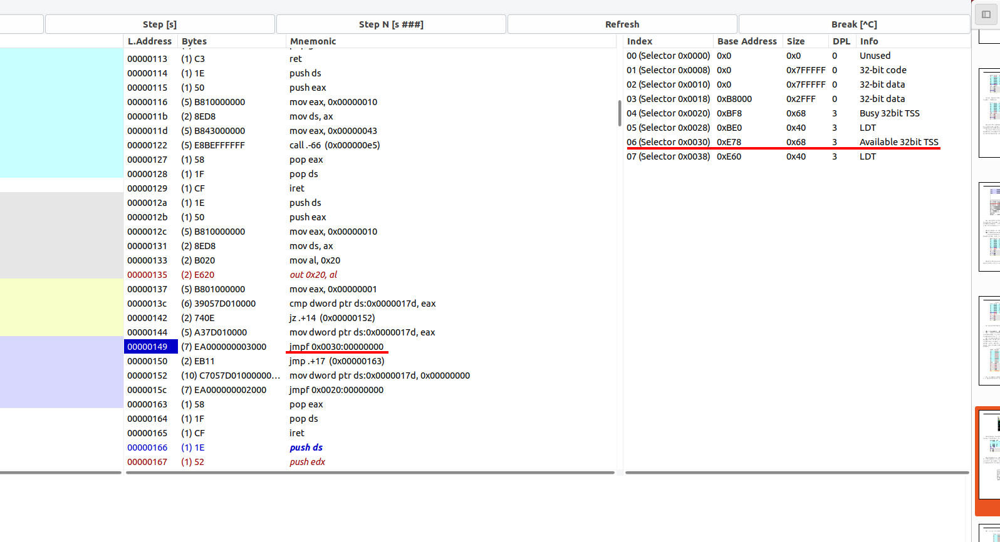
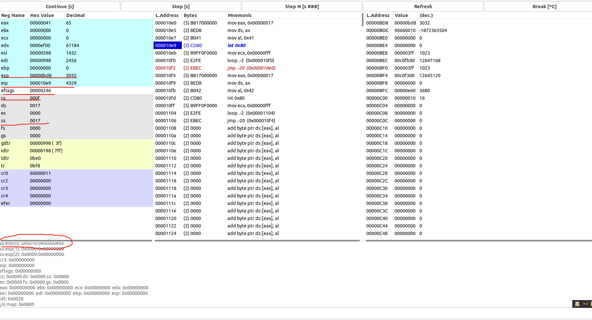

# 实验报告

1.请简述`head.s`的工作原理

在`head.s`中，主要分为几个部分：初始化、中断描述符表的设置以及中断处理程序

1. 初始化部分主要是设置基本的段寄存器，建立全局描述符表和中断描述符表,配置8253计时器芯片;

2. 关闭中断：为了确保操作系统能够正常地启动，`head.s`需要关闭中断，以免在初始化过程中被外部中断打断。

3. 中断处理程序部分包含了时钟中断处理程序、系统调用中断处理程序和忽略中断处理程序。时钟中断处理程序用于处理时钟中断，它在每个时钟中断被触发时将控制权转移到任务1。系统调用中断处理程序用于处理系统调用，它会在系统调用指令`int $0x80`被执行时被调用。忽略中断处理程序是一个简单的处理程序，用于在默认情况下处理未定义的中断。

2.请记录`head.s`的内存分布状况，写明每个数据段，代码段，栈段的起始与终止的内存地址

- GDT中全局代码段和数据段描述符的内容都设置为：基地址为0x0000，段限长值为0x07ff。
- 全局显示数据段被设置成：基地址为0xb8000，段限长值为0x0002;
- 两个Task在LDT中代码段和数据段描述符的内容都设置为：基地址为0x0000，段限长值为0x03ff；

3.简述`head.s`57至62行在做什么？

`head.s`57至62行主要的任务是为了移动到Task0，并执行其内容：
- `pushfl`将标志寄存器的值压入栈中，以便之后在修改标志寄存器后将其恢复回去。
- `andl $0xffffbfff, (%esp)`:将栈指针指向的值与0xffffbfff按位与运算，将标志寄存器中的第14位（TF）清零，以防止调试器在执行任务切换时中断。
- `popfl`:将修改后的标志寄存器的值弹出栈中，以恢复之前的标志寄存器的值。
- `movl $TSS0_SEL, %eax`：将TSS0的值移动到eax寄存器中。
- `ltr %ax`：将eax寄存器中的值作为任务寄存器（TR）加载，以切换到TSS0任务。
- `movl $LDT0_SEL, %eax`：将LDT0的值移动到eax寄存器中。
- `lldt %ax`：将eax寄存器中的值作为局部描述符表寄存器（LDTR）加载，以切换到LDT0段。

4.简述`iret`执行后，`pc`如何找到下一条指令？

`iret`指令从堆栈弹出返回地址，然后从堆栈弹出标志和代码段选择器，最后将指令指针设置为返回地址。因此，下一个要执行的指令是其地址存储在堆栈上的返回地址中的指令。

5.记录`iret`执行前后，栈是如何变化的？

我们以系统调用返回为例，如下图所示，在`iret`前，程序会恢复之前保存的ds、edx、ecx、ebx以及eax寄存器状态，然后在执行`iret`后会恢复原有的ss寄存器和esp寄存器，然后将PC设置为栈中的返回地址，回到原来的程序继续执行。

6.当任务进行系统调用时，即`int 0x80`时，记录栈的变化情况。

`int 0x80`代表的是程序去调用中断向量为8的中断处理程序，在`head.s`中是`system_interrupt`；

在执行前，ss寄存器和esp寄存器的值如上图所示，分别为0x17、0x0bd8;

在执行后，ss寄存器和esp寄存器的值如上图所示，分别为0x10、0x0e4c;并且cs寄存器的值为0x08，即跳转到中断向量为8的程序入口处；除此之外，程序还把原来的esp指针、ss寄存器的值以及返回地址压入了栈中；同时，在进入该处理程序后，程序还会相应地保存ds、edx、ecx、ebx以及eax寄存器相应的值，在处理结束`iret`前将上述的寄存器恢复到进入中断处理程序之前的状态。
