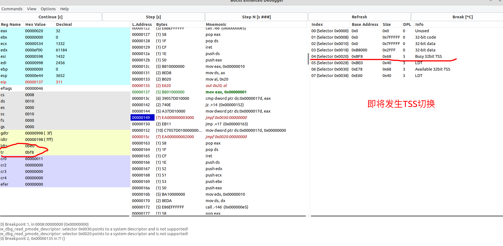

# 实验报告

### 题目一
1.当执行完`system_interrupt`函数，执行15行iret时，记录栈的变化情况。

如下图所示，在`iret`前，程序会恢复之前保存的ds、edx、ecx、ebx以及eax寄存器状态，然后在执行`iret`后会恢复原有的ss寄存器和esp寄存器，然后将PC设置为栈中的返回地址，回到原来的程序继续执行。

### 题目二
2.当进入和退出`system_interrupt`时，都发生了模式切换，请总结模式切换时，特权级是如何改变的？栈切换吗？如何进行切换的？

在模式切换期间，特权级也会发生变化。在进入中断处理程序时，特权级从用户模式切换到内核模式。这是为了确保中断处理程序具有足够的权限来执行其任务，同时限制其访问系统的其他部分。在退出中断处理程序时，特权级被切换回用户模式。

在这个过程中，发生了栈切换，SS寄存器存储的是堆栈段寄存器，在进入`system_interrupt`时，SS的值从0x0017转为0x0010;当退出`system_interrupt`时，SS的值从0x0010转为0x0017。

### 题目三
3.当时钟中断发生，进入到`timer_interrupt`程序，请详细记录从任务0切换到任务1的过程。

- `cmpl %eax, current`：将当前的任务号和eax寄存器中的值进行比较，当前的current为0，eax中寄存器为1，因此`je 1f`不发生跳转；

- `movl %eax, current`：此时设定current的值为1

- `ljmp $TSS1_SEL, $0`：切换到相应地任务，后面的地址偏移量没有实际用途但需要加上；然后寄存器的值会全部更新为TSS1里字段指定的值，而且由于任务1之前从未执行过，TSS1此时就是静态设置的数据。

如上图所示，图中画红线对应的是`ljmp $TSS1_SEL, $0`这条语句，即切换到Task1的TSS1，在GDT表中也可以看出该TSS处于可用状态；

上图是切换前TSS0段的信息；在进行切换时会对现场进行保存，在下个题目中就可以看出；

上图是切换后TSS1段的信息；

### 题目四
4.又过了10ms，从任务1切换回到任务0，整个流程是怎样的？TSS 是如何变化的？各个寄存器的值是如何变化的？

如上图所示，在10ms后再次进入时钟中断，这是可以看到程序即将切换到TSS0；

上图是切换前TSS1段的信息；在进行切换时会对现场进行保存;

上图是切换后TSS0段的信息,此时我们可以发现TSS0中的值不再是第一次时候大部分为0的状态，而是保存了上次切换时的寄存器状态，因此在发生任务切换的时候就可以将相应的寄存器进行恢复,具体的值如下图所示。

### 题目五
5.请详细总结任务切换的过程。

