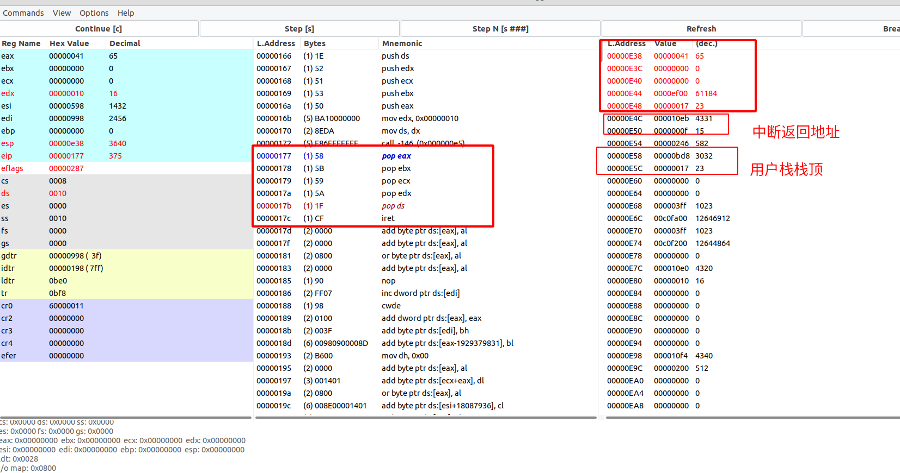

# 实验报告

### 题目一
1.当执行完`system_interrupt`函数，执行15行`iret`时，记录栈的变化情况。

如下图所示，在`iret`前，程序会恢复之前保存的ds、edx、ecx、ebx以及eax寄存器状态，然后在执行`iret`后会恢复原有的ss寄存器和esp寄存器，然后将PC设置为栈中的返回地址，回到原来的程序继续执行。

### 题目二
2.当进入和退出`system_interrupt`时，都发生了模式切换，请总结模式切换时，特权级是如何改变的？栈切换吗？如何进行切换的？

在模式切换期间，特权级也会发生变化。在进入中断处理程序时，特权级从用户模式切换到内核模式。这是为了确保中断处理程序具有足够的权限来执行其任务，同时限制其访问系统的其他部分。在退出中断处理程序时，特权级被切换回用户模式。

在这里，进入`system_interrupt`时，会先将特权级变换到0，根据任务0内核栈0x10:0x0e4c信息，ss寄存器和esp寄存器的值会相应地进行变换；在进入`system_interrupt`时，ss的值从0x0017转为0x0010，esp的值变为0x0e4c；同时，用户栈栈顶地址0x17:0x0bd8和中断返回地址0x0f:0x10eb被压到了内核栈栈顶;同理，当退出时候也会根据特权级的信息进行相应地变换。

### 题目三
3.当时钟中断发生，进入到`timer_interrupt`程序，请详细记录从任务0切换到任务1的过程。

- `cmpl %eax, current`：将当前的任务号和eax寄存器中的值进行比较，当前的current为0，eax中寄存器为1，因此`je 1f`不发生跳转；
- `movl %eax, current`：此时设定current的值为1
- `ljmp $TSS1_SEL, $0`：切换到相应地任务，后面的地址偏移量没有实际用途但需要加上；然后寄存器的值会全部更新为TSS1里字段指定的值，而且由于任务1之前从未执行过，TSS1此时就是静态设置的数据。

如上图所示，图中画红线对应的是`ljmp $TSS1_SEL, $0`这条语句，即切换到Task1的TSS1，在GDT表中也可以看出该TSS处于可用状态；

上图是切换前TSS0段的信息；在进行切换时会对现场进行保存，在下个题目中就可以看出；

上图是切换后TSS1段的信息；

### 题目四
4.又过了10ms，从任务1切换回到任务0，整个流程是怎样的？TSS 是如何变化的？各个寄存器的值是如何变化的？

如上图所示，在10ms后再次进入时钟中断，这是可以看到程序即将切换到TSS0；

上图是切换前TSS1段的信息；在进行切换时会对现场进行保存;

上图是切换后TSS0段的信息,此时我们可以发现TSS0中的值不再是第一次时候大部分为0的状态，而是保存了上次切换时的寄存器状态，因此在发生任务切换的时候就可以将相应的寄存器进行恢复,具体的值如下图所示。

### 题目五
5.请详细总结任务切换的过程。

任务切换的过程涉及到多个步骤:

1. 检查是否允许当前任务切换到新任务，在使用bochs查看GDT时候可以发现当前任务的TSS处于busy，而即将切换的任务的TSS是Available；
2. 保存当前任务的上下文:当一个任务正在执行时，它的寄存器值、堆栈指针以及其他与执行状态有关的信息都存储在处理器的寄存器和内存中。在任务切换之前，需要将当前任务的上下文信息保存下来，以便后面再次执行该任务时能够恢复到它的先前状态。如在题目4中所阐述的，在进行任务切换的时候，寄存器的信息会被保存在相应任务的TSS之中。
3. 切换TSS：在任务切换的时候，在保存了上一任务的现场后，通过LDTR指令实现TSS的切换；
4. 加载TSS中所保存的寄存器状态：在TSS切换后，需要从当前TSS中恢复任务执行需要的寄存器，如esp、ss、cs、eip等；
5. 开始执行新任务。

