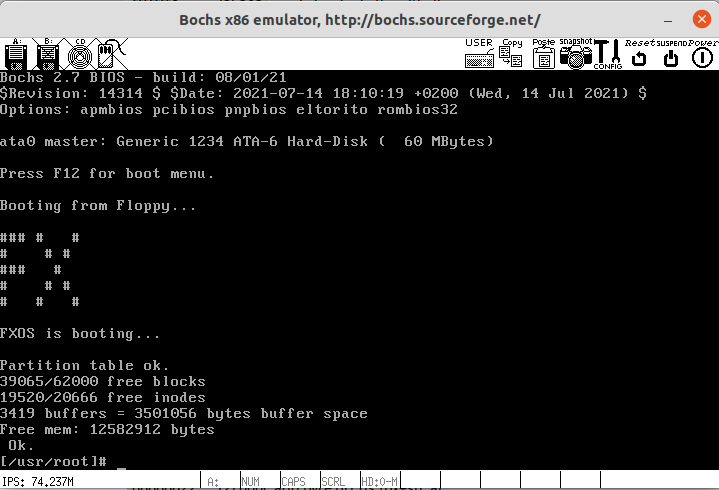
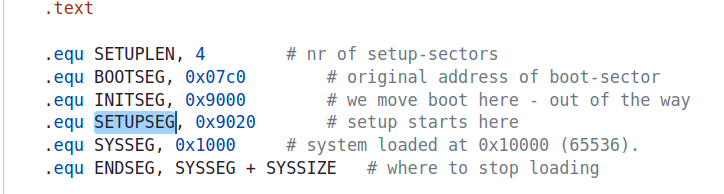
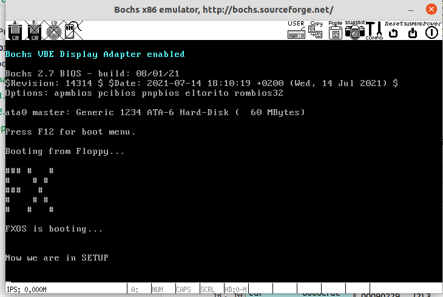
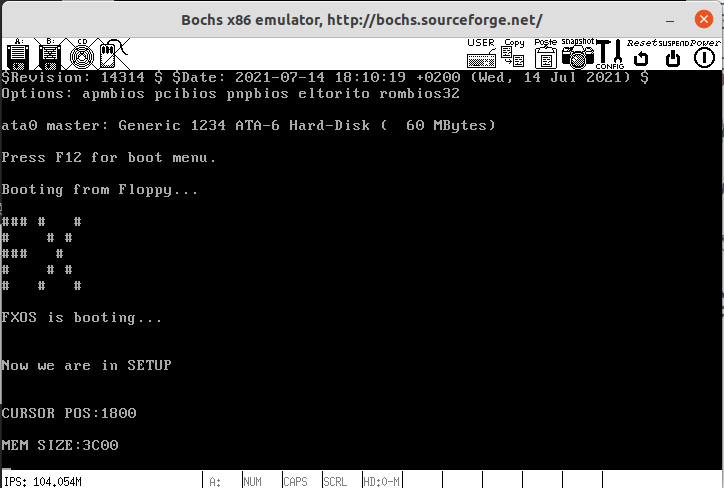
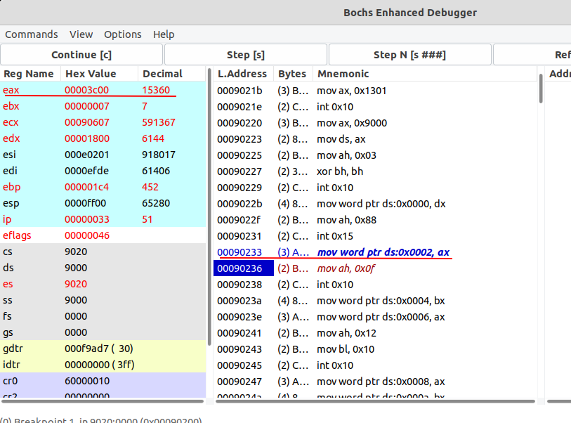

# 实验报告3-操作系统的引导

## 实验内容
1. 改写`bootsect.s`主要完成如下功能：
   `bootsect.s`能在屏幕上打印一段提示信息："XXX is booting..."
   其中`XXX`是你给自己的操作系统起的名字，也可以显示一个特色logo，以表示自己操作系统的与众不同。

2. 改写`setup.s`主要完成如下功能：
   `bootsect.s`能完成`setup.s`的载入，并跳转到`setup.s`开始地址执行。而`setup.s`向屏幕输出一行："Now we are in SETUP"
   `setup.s`能获取至少一个基本的硬件参数（如内存参数、显卡参数、硬盘参数等），将其存放在内存的特定地址，并输出到屏幕上。`setup.s`不再加载Linux内核，保持上述信息显示在屏幕上即可。

## 实验过程

### 1.改写bootsect.s并实现加载特定信息

首先，在`bootsect.s`中找到输出信息的语句，如下面的代码块所示；根据相关内容，我们可以看到这段语句的具体流程：加载msg1的长度给`%cx`，然后将设置要显示的字符串内容的地址。

```assembly
# Print some inane message

	mov	$0x03, %ah		# read cursor pos
	xor	%bh, %bh
	int	$0x10
	
	mov	$24, %cx
	mov	$0x0007, %bx		# page 0, attribute 7 (normal)
	#lea	msg1, %bp
	mov     $msg1, %bp
	mov	$0x1301, %ax		# write string, move cursor
	int	$0x10

...

# Msg1的存储
msg1:
	.byte 13,10
	.ascii "Loading system ..."
	.byte 13,10,13,10

	.org 508
```

修改后的代码块，字符串总长度为81，显式的内容为用"#"构建的FX图案以及字符串"FXOS is booting..."：

```assembly
# Print some inane message

	mov	$0x03, %ah		# read cursor pos
	xor	%bh, %bh
	int	$0x10
	
	mov	$81, %cx
	mov	$0x0007, %bx		# page 0, attribute 7 (normal)
	#lea	msg1, %bp
	mov     $msg1, %bp
	mov	$0x1301, %ax		# write string, move cursor
	int	$0x10

...

# Msg1的存储
msg1:
    .byte 13,10
    .byte 35,35,35,32,35,32,32,32,35,13,10
    .byte 35,32,32,32,32,35,32,35,32,13,10
    .byte 35,35,35,32,32,32,35,32,32,13,10
    .byte 35,32,32,32,32,35,32,35,32,13,10
    .byte 35,32,32,32,35,32,32,32,35,13,10
    .byte 13,10
    .ascii "FXOS is booting..."
    .byte 13,10,13,10
    
    .org 508
```

修改完成后使用`make all`语句进行编译，实验结果如图所示:



## 2.改写setup.s

首先修改`setup.s`使其能够显示信息"Now we are in SETUP"，具体过程如实验过程1所示。

然后查看`bootsect.s`，发现已经正确配置好`setup.s`入口，无需过多的操作。在编译后，程序未能正确输出信息，使用BochsGui进行调试，设置断点`vb 0x9020:0`，由图2所示的信息可知，`0x9020`是`setup.s`的入口。



经过排查后，发现，在进入中断，程序不能正确读取Msg2存储的字符串，即段寄存器未正确设置，在执行功能之前，添加如下代码即可：

```assembly
    mov	$SETUPSEG, %ax
    mov	%ax, %es
```

结果如下图所示：


然后按照根据指导书的教程，编写输出硬件参数的代码，如下所示：

```assembly
print_info:
    mov	$INITSEG, %ax
	mov	%ax, %ds
    mov	$SETUPSEG, %ax
	mov	%ax, %es

# Write Cursor Pos
    mov	$0x03, %ah		# read cursor pos
	xor	%bh, %bh
	int	$0x10
	mov	$13, %cx
	mov	$0x0007, %bx
	mov $msg_cursor, %bp
    mov	%cs, %ax
	mov	$0x1301, %ax
	int	$0x10
    mov %ds:0, %dx
    call print_hex
    call print_nl

# Write Mem Size
    mov	$0x03, %ah		# read cursor pos
	xor	%bh, %bh
	int	$0x10
    mov	$11, %cx
	mov	$0x0007, %bx
	mov $msg_mem, %bp
    mov	%cs, %ax
	mov	$0x1301, %ax
	int	$0x10
    movb $0x88, %ah
    int $0x15
    mov %ds:2, %dx
    call print_hex
    call print_nl

loop_f:
	jmp loop_f

# 打印十六进制
print_hex:
    movw    $4, %cx           # 4个十六进制数字
# 打印数字
print_digit:
    rolw    $4, %dx           # 循环以使低4比特用上 !! 取dx的高4比特移到低4比特处。
    movw    $0xe0f, %ax       # ah = 请求的功能值，al = 半字节(4个比特)掩码。
    andb    %dl, %al           # 取dl的低4比特值。
    addb    $0x30, %al        # 给al数字加上十六进制0x30
    cmpb    $0x3a, %al
    jl     outp             # 是一个不大于十的数字
    addb    $0x07, %al        # 是a～f，要多加7
outp:
    int    $0x10
    loop   print_digit
    ret
# 打印换行
print_nl:
    movw   $0xe0d, %ax
    int    $0x10
    movb   $0xa,%al
    int    $0x10
    ret
```

需要注意的是，每次打印之前都要获取光标的位置，否则打印的信息可能会错乱；除此之外，还需要设置死循环，避免进入内核态。实验结果如下图所示：



其中，内存大小为0x3C00KB，使用BochsGUI查看`int 0x15`获取硬件信息时，可以确定的是，`0x3C00`是当时写入栈的信息，如下图所示。且符合`bochsrc.bxrc`中所设置好的参数。



## 3.Q&A

Q：有时，继承传统意味着别手蹩脚。`x86`计算机为了向下兼容，导致启动过程比较复杂。请找出`x86`计算机启动过程中，被硬件强制，软件必须遵守的两个“多此一举”的步骤（多找几个也无妨），说说它们为什么多此一举，并设计更简洁的替代方案。

A：
1. 在x86启动时，初始是处于实模式下的，保护模式必须由引导程序进行启动。但是，实模式的寻址方式和内存管理非常有限，限制了计算机的启动效率。解决方案：这可能是历史遗留问题，在现如今的科技水平之下，可以直接从保护模式启动计算机，而不经过实模式，省去切换的步骤。
2. 在启动时，BIOS会初始化中断向量表在内存的前端部分，导致system模块先加载到稍后的位置，在setup获取完硬件参数（使用中断进行获取）后，再把整个system模块从后往前挪动；解决方案：System模块从内存初始位置开始加载，1KB的中断向量表放置在其他可以访问到的且不与System冲突的内存空间上。除此之外，实模式下的中断已经很少被使用了。

