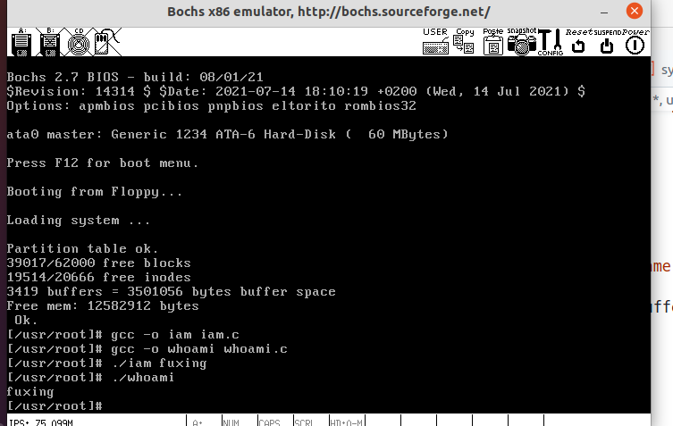
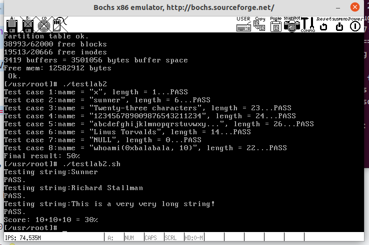

# 实验报告4-系统调用

## 实验内容

此次实验的基本内容是：在`Linux 0.11`上添加两个系统调用，并编写两个简单的应用程序测试它们。

## 实验过程

### 1.增加 iam 和 whoami 的系统调用

首先，仿照原有的系统调用，在`include/unistd.h`中，添加`iam`和`whoami`的定义，如下图所示。在`__NR__XXX`后面跟着的就是系统调用的编号，在终端`int 0x80`中会使用到。


在内核初始化时，主函数会调用`sched_init()`函数，该函数会填写`IDT`，将`system_call`函数地址写到`0x80`对应的中断描述符中，也就是在中断`0x80`发生后，自动调用函数`system_call`。在`system_call`中，会根据系统调用编号去调用相对应的程序，即`call sys_call_table(,%eax,4)`；在这里，可以发现，我们还需要将`iam`和`whoami`系统调用在`sys_call_table`中定义，以便其能正确寻址，如下图所示:


这一步骤中，需要注意的是，先将Linux0.11的存储挂载到当前系统上，然后再对这两个文件进行修改。在实验中，是直接修改Linux源码中的，在实验环境中编译时出现`undeclared`错误，仔细一查，哎，include中还是原来的文件。

### 2.构建kernel/who.c文件并完成程序编写

在编写程序时，获取用户地址空间（用户数据段）中的数据依靠的就是段寄存器`fs`，用`get_fs_byte()`获得一个字节的用户空间中的数据。 同样地，实现从核心态拷贝数据到用心态内存空间，调用`put_fs_byte()`即可。根据需要，完成`who.c`的代码，如下所示:

```C
#include <errno.h>
#include <asm/segment.h>

#include <string.h>

#define MAX_SIZE 23

char buffer[MAX_SIZE+5];

int sys_iam(const char *name)
{
    char tmp[MAX_SIZE+6];
    int i = 0;
    // 从用户空间中读取数据
    while(i <= MAX_SIZE+5)
    {
        tmp[i] = get_fs_byte(name+i);
        if(tmp[i] == '\0') break;
        i++;
    }
    if(i<=MAX_SIZE){
        strcpy(buffer, tmp);
    }else{
        return -EINVAL; // 系统调用会自动取相反数赋给errno
    }
    return i;
}

int sys_whoami(char *name, unsigned int size)
{
    int len = strlen(buffer);
    if (size < len)
    {
        return -EINVAL; // 系统调用会自动取相反数赋给errno
    }
    else
    {
        for (int i = 0; i < len; i++)
        {
            put_fs_byte(buffer[i], name + i);
        }
    }
    return len;
}

```

### 3.修改MakeFile

需要编译新构建的who.c文件，并将其正确链接，这里根据实验教程步骤即可完成。

### 4.编写测试程序

这里的测试程序还是比较简单的，不过多赘述。

```C
#define __LIBRARY__
#include <errno.h>
#include <unistd.h>
#include <stdio.h>

_syscall1(int, iam, const char*, name);
int main(int argc, char ** argv)
{
    iam(argv[1]);
    return 0;
}
```

```C
#define __LIBRARY__
#include <errno.h>
#include <unistd.h>

_syscall2(int, whoami,char*,name,unsigned int,size);

int main(int argc, char ** argv)
{
	char tmp[30];
	whoami(tmp, 24);
	printf("%s\n", tmp);
	return 0;
}
```


### 5.实验结果

初步测试结果：


测试程序上的测试结果：


在这里需要注意的是，由于系统调用返回负数时会自动调用错误处理程序，他会根据返回值的相反数设置`errno`，因此在`who.c`中不需要显式地位`errno`赋值。  

## 实验Q&A

Q：
从`Linux 0.11`现在的机制看，它的系统调用最多能传递几个参数？

A：
从`unistd.h`来看最多三个，分别用三个寄存器ebx，ecx，edx来存储调用时的参数。

---
Q：
你能想出办法来扩大这个限制吗？

A：


---
Q：用文字简要描述向`Linux 0.11`添加一个系统调用`foo()`的步骤。

A：

- 首先，在`unistd.h`中定义该系统调用；然后再`linux/sys.h`将该系统调用加入系统调用表中，并在`system_call.s`中更新系统调用总数。
- 然后编写`foo()`函数，并根据文件结构更新MakeFile文件。
