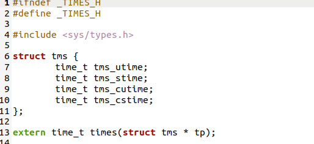
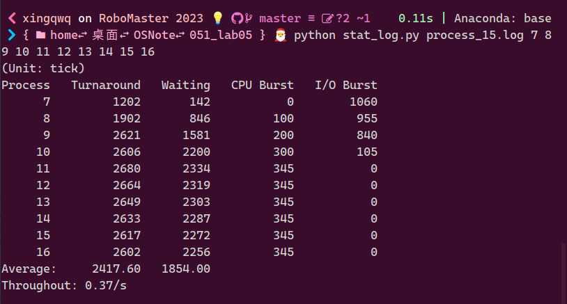
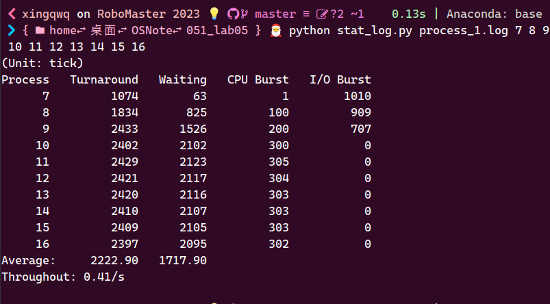
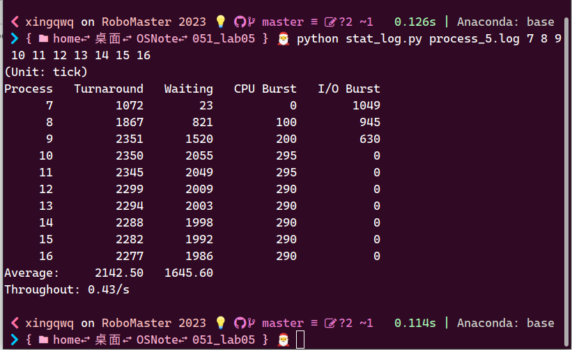
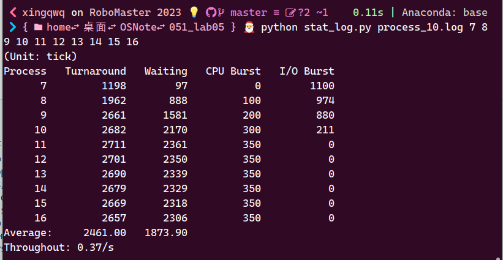
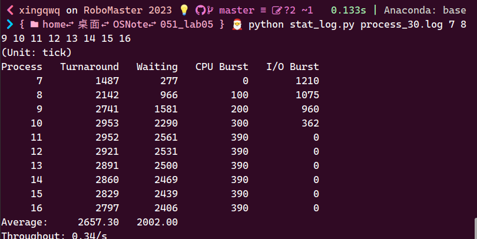
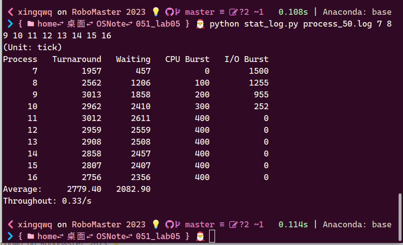
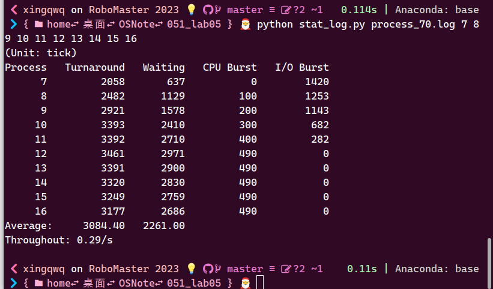
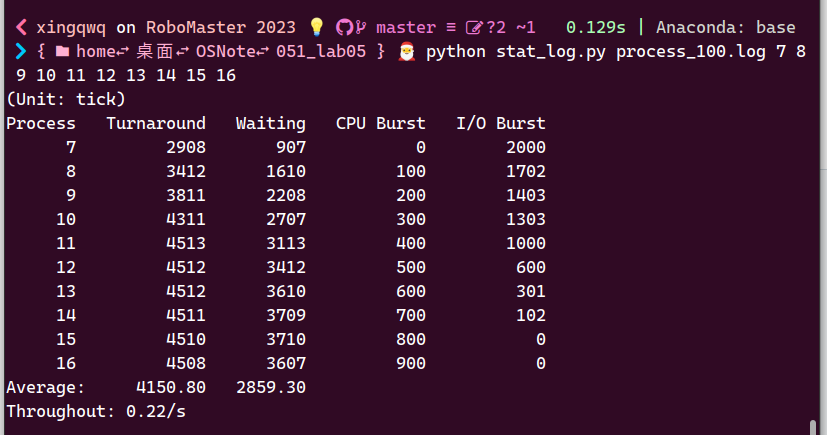

# 实验报告5-进程运行轨迹的跟踪与统计

## 实验内容

1. 基于模板`process.c`编写多进程的样本程序，实现如下功能：
   - 所有子进程都并行运行，每个子进程的实际运行时间一般不超过 30 秒；
   - 父进程向标准输出打印所有子进程的 id ，并在所有子进程都退出后才退出；
2. 在`Linux 0.11`上实现进程运行轨迹的跟踪。基本任务是在内核中维护一个日志文件`/var/process.log`，把从操作系统启动到系统关机过程中所有进程的运行轨迹都记录在这一`log`文件中。
3. 在修改过的`0.11`上运行样本程序，通过分析`log`文件，统计该程序建立的所有进程的等待时间、完成时间（周转时间）和运行时间，然后计算平均等待时间，平均完成时间和吞吐量。可以自己编写统计程序，也可以使用`python`脚本程序`stat_log.py`进行统计。
4. 修改`Linux0.11`进程调度的时间片，然后再运行同样的样本程序，统计同样的时间数据，和原有的情况对比，体会不同时间片带来的差异。

## 实验过程

### 1.process.c的编写

首先，根据实验教程阐述的需求，编写`cpuio_bound()`函数。这个函数需要使用到时间相关的记录，查阅`Linux0.11`库的头文件，可以看到其所提供的事件库为`tms`，具体定义如下所示：



其中，`tms_utime`为用户程序CPU时间，`tms_stime`为系统调用所耗费的CPU时间，`tms_cutime`是已死掉的子进程的CPU时间，`tms_cstime`是已死掉的子进程的系统调用耗费的CPU时间。因此，使用当前时刻和上一时刻的`tms_utime`时间差以及`tms_stime`的时间差就可以得到当前进程占用的CPU时间。

`cpuio_bound()`使用`tms`获取CPU访问时间并加以控制，使用`sleep()`函数模拟I/O操作。然后，编写`main()`函数，用`fork()`建立若干个同时运行的子进程，用`wait()`使得父进程等待所有子进程退出后才退出；每个子进程按照执行相同的`cpuio_bound()`操作，即：

```C
int main(int argc, char *argv[])
{
    pid_t procs[10];
    int id = 0;
    for (id = 0; id < 10; id++)
    {
        procs[id] = fork();
        if (procs[id] == 0)
        {
            cpuio_bound(20, id + 5, 15 - id);
            return 0;
        }
        else if(procs[id]<0)
        {
            printf("Fork Error.\n");
            return -1;
        }
    }
    for (id = 0; id < 10; id++)
    {
        printf("Child ID: %d\n", procs[id]);
    }
    wait(&id);
    return 0;
}
```

### 2.记录日志到log文件中

首先，在`main.c`中创建log文件的文件描述符并关联到3，即：

```C
(void) open("/var/process.log",O_CREAT|O_TRUNC|O_WRONLY,0666);
```

然后，在`printk.c`中添加函数`fprintk()`：

```C
int fprintk(int fd, const char *fmt, ...)
{
    va_list args;
    int count;
    struct file * file;
    struct m_inode * inode;

    va_start(args, fmt);
    count=vsprintf(logbuf, fmt, args);
    va_end(args);

    if (fd < 3)    /* 如果输出到stdout或stderr，直接调用sys_write即可 */
    {
        __asm__("push %%fs\n\t"
            "push %%ds\n\t"
            "pop %%fs\n\t"
            "pushl %0\n\t"
            "pushl $logbuf\n\t" /* 注意对于Windows环境来说，是_logbuf,下同 */
            "pushl %1\n\t"
            "call sys_write\n\t" /* 注意对于Windows环境来说，是_sys_write,下同 */
            "addl $8,%%esp\n\t"
            "popl %0\n\t"
            "pop %%fs"
            ::"r" (count),"r" (fd):"ax","cx","dx");
    }
    else    /* 假定>=3的描述符都与文件关联。事实上，还存在很多其它情况，这里并没有考虑。*/
    {
        // if (!(file=task[0]->filp[fd]))    /* 从进程0的文件描述符表中得到文件句柄 */
        //    return 0;
        
        // 修改为如下：
        // task[1]->filp is not ready or f_inode->i_dev is not ready
        if (!(file=task[1]->filp[fd]) || !task[1]->filp[fd]->f_inode->i_dev) {   /* 从进程1的文件描述符表中得到文件句柄 */
            return 0;
        }
        inode=file->f_inode;

        __asm__("push %%fs\n\t"
            "push %%ds\n\t"
            "pop %%fs\n\t"
            "pushl %0\n\t"
            "pushl $logbuf\n\t"
            "pushl %1\n\t"
            "pushl %2\n\t"
            "call file_write\n\t"
            "addl $12,%%esp\n\t"
            "popl %0\n\t"
            "pop %%fs"
            ::"r" (count),"r" (file),"r" (inode):"ax","cx","dx");
    }
    return count;
}
```

然后在`kernel/fork.c`的`copy_process()`函数中，根据需求，输出进程的状态（新建/就绪）。一个设置在记录`start_time`之后，即进程创建;一个设置在`TASK_RUNNING`之后，即进程就绪；

在`kernel/sched.c`中输出进程的状态(就绪/运行/阻塞)。就绪态和运行态之间的转移是通过`schedule()`实现的；运行态到阻塞态之间的转移通过`sleep_on()`、`interruptible_sleep_on()`、`sys_pause()`以及`sys_waitpid()`；阻塞态到就绪态通过`wakeup()`实现。在这里需要注意的是：
- `schedule()`找到的`next`进程如何和当前正在运行的进程是一致的话，其中不涉及到进程的切换，因而进程的状态也不会发生改变。
- 系统无事可做的时候，进程`0`会不停地调用`sys_pause()`，以激活调度算法。

以及，在`kernel/exit.c`中也有涉及进程状态的设置。在完成上述三个文件相关输出的设置后，即可运行系统开始对进程轨迹进行跟踪。

最终的程序统计信息截图:



### 3.修改时间片

所以总的来说，`Linux 0.11`的进程调度是一种综合考虑进程优先级并能动态反馈调整时间片的轮转调度算法，对正被阻塞的进程来说，一个进程在阻塞队列中停留的时间越长，其优先级越大，被分配的时间片也就会越大。在修改时间片大小时，具体修改的是`include/linux/sched.h`中宏定义`INIT_TASK`的`priority`数值，初值为15。下面的修改时间片大小后的实验结果:

时间片大小为1的统计结果：



时间片大小为5的统计结果：



时间片大小为15的统计结果：



时间片大小为30的统计结果：



时间片大小为50的统计结果：



时间片大小为70的统计结果：



时间片大小为100的统计结果：



## 实验Q&A

Q：
结合自己的体会，谈谈从程序设计者的角度看，单进程编程和多进程编程最大的区别是什么？

A：
单进程编程逻辑相对简单，但是不能高效利用多核CPU的优势；而多进程可以利用多核CPU的优势来提升程序的效率，使得程序可以并发执行，但是编程难度较高，而且进程作为操作系统分配资源的单位，各个进程之间资源并不是可以直接访问的，需要特定的方式进行进程间的通讯；除此之外，多进程在编程时还需要考虑互斥和同步的问题。

---
Q：
你是如何修改时间片的？仅针对样本程序建立的进程，在修改时间片前后， log 文件的统计结果（不包括Graphic）都是什么样？结合你的修改分析一下为什么会这样变化，或者为什么没变化？

A：
在修改时间片大小时，具体修改的是`include/linux/sched.h`中宏定义`INIT_TASK`的`priority`数值。具体的实验结果如上述2.3节的结果。从上面的实验结果，我们不难发现，随着时间片的增大，平均等待时间和平均周转时间都在不断增加，这是由于CPU在每个进程上耗费的时间过多，此外随着不断有进程进来，导致先到的进程还需要等待后续进程长时间片的完成，因而导致了平均等待时间的增长；除此之外，还可以发现，时间片也不是越小越好的，由于进程切换需要保存进程上下文等操作，过于频繁地切换也会导致平均周转时间的增加。