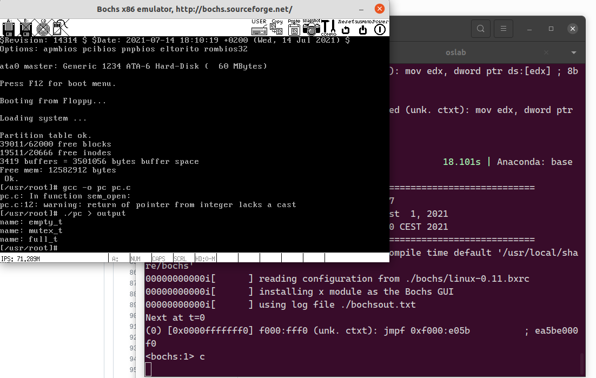
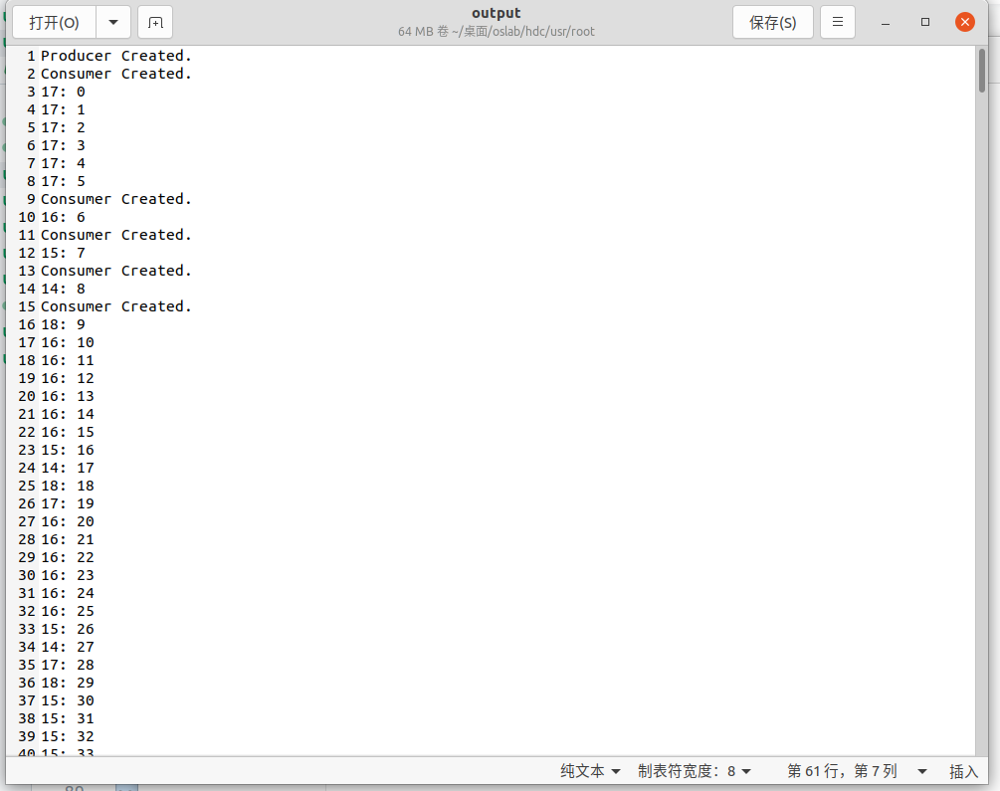
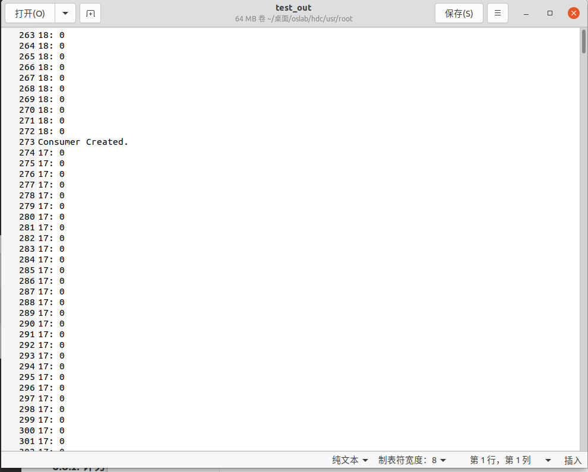

# 实验报告5-信号量的实现和应用

## 实验内容

- 在`Ubuntu`下编写程序，用信号量解决生产者——消费者问题；
- 在`0.11`中实现信号量，用生产者—消费者程序检验之。
- 用信号量解决生产者—消费者问题。

## 实验过程

这个实验还是特别有意思的，就是在Linux0.11下Bug不太好de；

### 1.实现信号量

在这里实现的是一个缩水版的信号量，下述是几个函数的原型；

```C
sem_t *sem_open(const char *name, unsigned int value);
int sem_wait(sem_t *sem);
int sem_post(sem_t *sem);
int sem_unlink(const char *name);
```

但实验环境中并没有给出`sem_t`的具体定义，而是根据自己编程的需求来确定；那么，首先就是对`sem_t`的定义，如下所示；`sem_t`具体定义为信号量结构体，里面包含信号量的名称，信号量的值，以及当前信号量下所阻塞的任务队列，这个任务队列是一个链表结构，存储的是系统进行任务调度的`task_struct`结构体。

```C
struct taskQueue{
	struct task_struct *task;
    struct taskQueue* next;
};

struct sem_t{
	int value;
	char name[NAME_LEN];
	struct taskQueue* queue;
};

struct sem_t *sem_table[TABLE_LEN]; // 信号量表
```

下面简要阐述四个功能函数的运行过程：
- `sem_open()`：首先从用户空间中读取出所要定义的信号量名称；进而判断当前名称是否在信号量表中，如果在则直接返回相关指针；如果不在则需要在信号量表中为当前信号量进行分配，成功分配返回指针，空间不足则报错；
- `sem_unlink()`：首先从用户空间中读取出所要删除的信号量名称，然后根据名称从信号量表中删除即可。
- `sem_wait()`：首先信号量值减1，然后判断是否需要阻塞该进程；如果要阻塞，则将该进程加入当前信号量的阻塞队列中，并调用`sleep_on()`函数使其休眠；
- `sem_post()`:首先信号量值加1，如果信号量的值依旧小于等于0代表当前信号量的阻塞队列中有等待唤醒的任务，则取出任务并调用`wake_up()`函数使其退出休眠。

除了上述的四个基本功能函数，还需要一系列的辅助函数，包括`get_len()`从用户空间中读取数据并返回长度，`find_sem()`查找信号量在信号量表中的位置，`push_task()`将任务加入某信号量的阻塞队列中，`pop_task()`从某信号量的阻塞队列中取出任务等等。

### 2.实现一个生产者-消费者

首先，这是一个缓冲区大小为10的生产者-消费者问题，除此之外，由于使用共享文件作为缓冲区，因此每次只能有一个进程访问该共享文件；在这里，我们需要设置三个信号量，分别为`full`，`empty`，`mutex`；`full`表示当前缓冲区有多少个数据，消费者只有在缓冲区有数据时才能获取数据；`empty`表示当前缓冲区还剩多少个空位给生产者放置数据，当缓冲区已经满时生产者不能放置数据，直到出现空位；`mutex`的初始值为1，表示每次只能有一个进程访问该缓冲区，具体代码如下所示：

```C
int main()
{
    struct sem_t *empty, *full, *mutex;
    int fin, fout;
    int i, j, readData, pid;
    int cnt = 0;
    pid_t p;
    if ((empty = sem_open("empty_t", BUFSIZE)) == NULL)
    {
        return -1;
    }
    if ((mutex = sem_open("mutex_t", 1)) == NULL)
    {
        return -1;
    }
    if ((full = sem_open("full_t", 0)) == NULL)
    {
        return -1;
    }
    fin = open("buffer.dat", O_CREAT | O_WRONLY | O_TRUNC, 0222);
    fout = open("buffer.dat", O_RDONLY | O_TRUNC, 0444);
    if ((p = fork()) == 0)
    {
        printf("Producer Created.\n");
        fflush(stdout);
        for (i = 0; i < NUMBER; i++)
        {
            sem_wait(empty);
            /* printf("empty in.\n");*/
            sem_wait(mutex);
            /* printf("mutex in.\n");*/
            if (i % BUFSIZE == 0)
            {
                lseek(fin, 0, 0);
            }
            write(fin, (char *)&i, sizeof(int));
            /*printf("Producer %d: %d\n", getpid(), i);*/
            /*fflush(stdout);*/
            sem_post(mutex);
            /*printf("mutex out.\n");*/
            sem_post(full);
        }
        sleep(2);
        return 0;
    }
    else if (p < 0)
    {
        perror("Fork Error.\n");
        return -1;
    }
    for (j = 0; j < CONSUMER; j++)
    {
        if ((p = fork()) == 0)
        {
            printf("Consumer Created.\n");
            while(1)
            {
                sem_wait(full);
                sem_wait(mutex);
                if (!read(fout, (char *)&readData, sizeof(int)))
                {
                    lseek(fout, 0, 0);
                    read(fout, (char *)&readData, sizeof(int));
                }
                printf("%d: %d\n", getpid(), readData);
                fflush(stdout);
                sem_post(mutex);
                sem_post(empty);
            }
        }
        else if (p < 0)
        {
            perror("Fail to fork!\n");
            return -1;
        }
    }
    wait(NULL);
    sem_unlink("empty_t");
    sem_unlink("mutex_t");
    sem_unlink("full_t");
    close(fin);
    close(fout);
    return 0;
}
```

## 实验结果

下图为运行命令，在内核态构建信号量时输出了相对应的名称，并且用户进程输出的消息写入`output`文件中以便查询。


下图是`output`文件，可以验证程序正确执行并写入。


## 实验Q&A
Q：
在`pc.c`中去掉所有与信号量有关的代码，再运行程序，执行效果有变化吗？为什么会这样？

A：
测试去掉信号量的代码，并将结果输出到`test_out`中，如下图所示，可以发现由于没有信号量的存在，生产者和消费者之间不能做到同步，当消费者进程先创建时就会读到0，并一直输出0。



除此之外，缺少对共享文件的互斥访问，同一个进程读数的顺序可能也会发生混乱，如下图所示，进程15在输出完540后有输出540；


---
Q：
实验的设计者在第一次编写生产者——消费者程序的时候，是这么做的：
```C
Producer()
{
    P(Mutex);  //互斥信号量
    // 生产一个产品item;
    P(Empty);  //空闲缓存资源
    // 将item放到空闲缓存中;
    V(Full);  //产品资源
    V(Mutex);
}

Consumer()
{
    P(Mutex);
    P(Full);
    // 从缓存区取出一个赋值给item;
    V(Empty);
    // 消费产品item;
    V(Mutex);
}
```
这样可行吗？如果可行，那么它和标准解法在执行效果上会有什么不同？如果不可行，那么它有什么问题使它不可行？

A：
这么做不可行，首先获取互斥资源，会导致死锁；例如当前缓冲区没有数了，但消费者进程申请了互斥资源，但由于缓冲区没有数据，因此阻塞在`P(Full)`上，但没有释放互斥锁资源；当生产者要生产时，会申请互斥锁资源，发现被占用，其被阻塞在`P(Mutex)`，进而死锁。正确做法是首先判断是否可以进入临界区，然后再申请互斥锁。