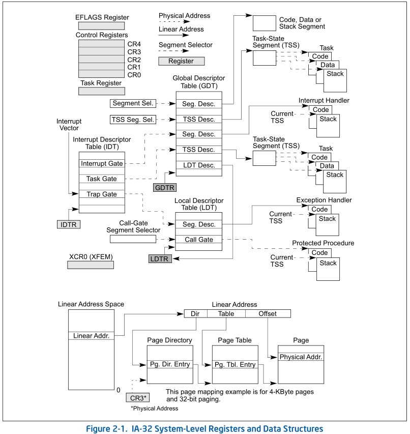
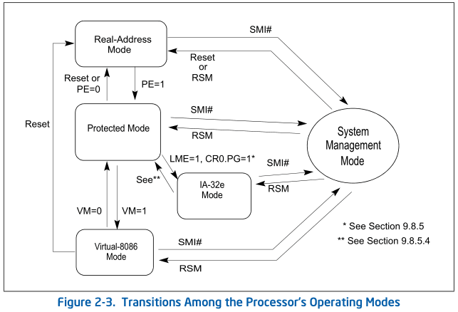
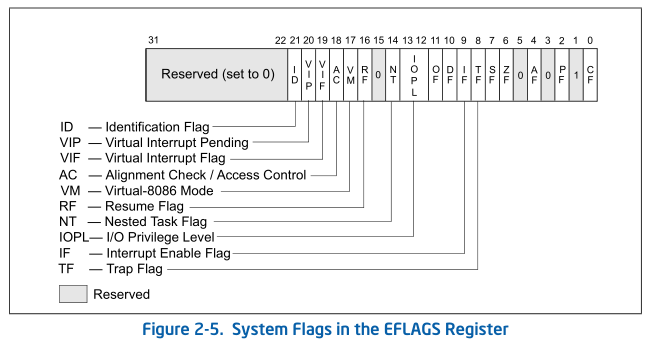
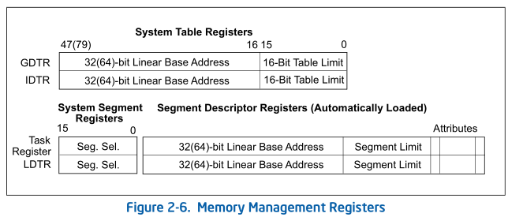
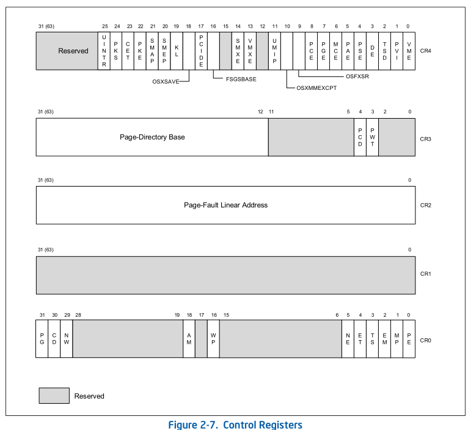

# 1.x86 系统架构概览

## 1.1 系统及体系结构概览

在图 2.1 中，展⽰了系统级寄存器和数据结构，其中比较重要的概念有:

### 段（Segment）

一个程序可以拥有许多独立的地址空间，可以将其代码和堆栈保存在段中。

### 段描述符（Segment Descriptor）

段描述符提供了段的基址、访问权限、类型和使用信息。

### 段选择器

每个段描述符都有一个相关联的段选择器。段选择器为使用它的程序提供了到 GDT 或 LDT 的索引(相关段描述符的偏移量)，一个全局/局部标志(决定选择器是指向 GDT 还是 LDT)，以及访问权限信息。

### 全局描述符表（GDT）和局部描述符表（LDT）

在保护模式下运行时，所有内存访问都通过全局描述符表(GDT)或可选的本地描述符表(LDT)，如图 2-1 所示。这些表包含了称为**段描述符的条目，段描述符提供段的基址以及访问权限、类型和使用信息**。GDT 的线性基地址包含在 GDT 寄存器(GDTR)中；LDT 的线性基地址包含在 LDTR 中；

### 系统段

除了组成程序或过程执行环境的代码、数据和堆栈段之外，该体系结构还定义了两个系统段:**任务状态段**(task-state segment, TSS)和**LDT**。GDT 不被认为是段，因为它不是通过段选择器和段描述符访问的。

### 门（Gate）

该体系结构还定义了一组称为门的特殊描述符，例如调用门（Call Gate）、中断门（Interrupt Gate）、陷阱门（Trap Gate）和任务门（Task Gate）。它们为那些可能在不同于大多数过程的特权级别上的操作系统过程和处理程序提供了**受保护的网关**（Gateway）。例如，对调用门可以提供对代码段的访问，如果允许访问目标代码段，处理器获取目标代码段的段选择器，并从调用门获取该代码段的偏移量。如果调用需要更改特权级别，处理器也会切换到目标特权级别的堆栈，新堆栈的段选择器是从当前运行任务的 TSS 中获得的。

### 任务状态段（Task-State Segment）和任务门（Task-Gate）

TSS 定义了任务执行环境的状态，包括**通用寄存器**、**段寄存器**、**EFLAGS 寄存器**、**EIP 寄存器**和**段选择器**的状态，段选择器带有三个堆栈段的堆栈指针(每个特权级别对应一个堆栈)。TSS 还包括与任务关联的**LDT 的段选择器**和**分页结构层次结构的基址。**

在切换任务时，处理器执行以下操作:

1. 在当前 TSS 中存储当前任务的状态。
2. 用新任务的段选择器加载任务寄存器。
3. 通过 GDT 中的段描述符访问新的 TSS。
4. 将新任务的状态从新的 TSS 加载到通用寄存器、段寄存器、LDTR、控制寄存器 CR3(分页结构层次结构的基址)、EFLAGS 寄存器和 EIP 寄存器。
5. 开始执行新任务。

### 中断和异常处理

外部中断、软件中断和异常都是通过中断描述符表(IDT)处理的。IDT 存储一组门描述符，这些描述符提供对中断和异常处理程序的访问。与 GDT 一样，IDT 也不是一个段。IDT 的基地址存储在 IDT 寄存器(IDTR)中。

IDT 中的门描述符可以是中断、陷阱或任务门描述符。为了访问中断或异常处理程序，处理器首先通过 INT n、INTO、INT3、INT1 或 BOUND 指令从内部硬件、外部中断控制器或软件接收中断向量，然后由中断向量提供 IDT 的索引。如果选择的门描述符是中断门或陷阱门，则以类似于通过调用门访问相关处理程序过程。如果描述符是一个任务门，则通过 Task Switch 访问处理程序。

### 内存管理

内存有两种寻址方式：直接物理寻址和基于分页的虚拟内存。直接物理寻址即将其视为线性地址进行寻址。而虚拟内存则需要对所有的代码、数据、堆栈、系统段（包括不是系统段的 GDT 和 IDT）进行分页，只有最近访问的页面保存在物理内存中。页在物理内存中的位置包含在分页结构中，这些结构驻留在物理内存中。
如图 2-1 底部结构所示，分页层次结构的物理基地址包含在控制寄存器 CR3 中,分页结构中的条目确定页的物理基地址、访问权限和内存管理信息。为了使用这种分页机制，一个线性地址被分解成几个部分，包括分页结构和页帧提供单独的偏移量。一个系统可以有一个或多个分页结构的层次结构。例如，每个任务可以有自己的层次结构。

### 系统寄存器

为了帮助初始化处理器和控制系统操作，系统架构在 EFLAGS 寄存器和几个系统寄存器中提供了系统标志:

- EFLAGS 寄存器中的系统标志和 IOPL 字段控制任务和模式切换，中断处理，指令跟踪和访问权限。
- 控制寄存器(CR0, CR2, CR3 和 CR4)包含各种用于控制系统级操作的标志和数据字段。这些寄存器中的其他标志用于指示操作系统或执行程序中对特定处理器功能的支持。
- 调试寄存器允许在调试程序和系统软件时设置断点。
- GDTR、LDTR 和 IDTR 寄存器包含各自表的线性地址和大小。
- 任务寄存器包含当前任务的 TSS 的线性地址和大小。
- 特定于模型的寄存器。

模型特定寄存器（MSRs）是一组主要用于操作系统或执行特权级别为 0 的代码的寄存器，这些寄存器控制诸如调试扩展、性能监视计数器、机器检查体系结构和内存类型范围(MTRRs)等。大多数系统限制应用程序对系统寄存器(EFLAGS 寄存器除外)的访问。然而，系统可以设计为所有程序和过程都运行在最高特权级别(特权级别 0)，在这种情况下，应用程序将被允许修改系统寄存器。

## 1.2 操作模式

### 保护模式

这是处理器的本机工作模式，它提供了一组丰富的体系结构特性，如灵活性、高性能以及对现有软件库的向后兼容性。

### 实地址模式

这种工作模式提供了英特尔 8086 处理器的编程环境，并提供了一些扩展(例如切换到受保护或系统管理模式的能力)。

### 系统管理模式（SMM）

SMM 是所有 IA-32 处理器的标准架构特性，从 Intel386 SL 处理器开始。这种模式提供了一个具有透明机制的操作系统或执行器，用于实现电源管理和 OEM 差异化功能。SMM 是通过激活外部系统中断引脚（SMI#）进入的，它生成一个系统管理中断（SMI）。在 SMM 中，处理器切换到一个单独的地址空间，同时保存当前运行的程序或任务的上下文，然后可以透明地执行特定于 SMM 的代码。当从 SMM 返回时，处理器被放回到 SMI 之前的状态。

### Virtual-8086 模式

在保护模式下，处理器支持一种被称为 virtual8086 模式的准操作模式。这种模式允许处理器在受保护的多任务环境中执行 8086 软件。

### 实地址模式和保护模式转换

"实模式-> 保护模式"的跳转：
1. 关中断
2. 打开地址线
3. 设置CR0寄存器的末位(PE)为1
4. 实现跳转，进入保护模式

"保护模式-> 实模式"的跳转：
1. 从保护模式下的32位代码段跳转到16位代码段
2. 在16位代码段下初始化所有段寄存器
3. 设置CR0寄存器的末位(PE)为0
4. 实现跳转，回到实模式

## 1.3 80x86 系统指令寄存器

### 标志寄存器 EFLAGS

标志寄存器 EFLAGS 是架构中⾮常重要的⼀个寄存器，它包含了⼀些⼆进制标志位，⽤于反映处理器的运⾏状态、控制处理器的⾏为和指令的执⾏结等信息，只允许特权代码(通常是操作系统或执行代码)可以修改这些标志位。

- Trap，单步调试模式相关标志位
- IF，控制处理器对可屏蔽硬件中断请求的响应。
- IOPL，表示当前运行的程序或任务的 I/O 特权级别。当前运行的程序或任务的 CPL 必须小于等于 IOPL 才能访问 I/O 地址空间。POPF 和 IRET 指令只有在 CPL 为 0 时才能修改该字段。
- NT，控制中断任务和被调用任务的链接。处理器在调用 CALL 指令、中断或异常启动的任务时设置此标志。它检查并修改由 IRET 指令启动的任务的返回值。该标志可以通过 POPF/POPFD 指令显式地设置或清除;但是，更改此标志的状态可能会在应用程序中产生意外的异常。
- RF，控制处理器对指令断点条件的响应。
- VM，设置启用 virtual-8086 模式
- AC，如果在 CR0 寄存器中设置了 AM 位，当且仅当该标志为 1 时，启用用户模式数据访问的对齐检查。
- VIF，包含 IF 标志的虚拟映像，与 VIP 旗一起使用。
- VIP，由软件设置，表示中断正在等待;清除表示没有挂起中断。该标志与 VIF 标志一起使用。处理器读取这个标志，但从不修改它。
- ID，支持 CPUID 指令。

### 内存管理寄存器

- **GDTR**，保存 GDT 基地址。LGDT 和 SGDT 指令分别加载和存储 GDTR 寄存器。开机或重置在处理器中，基地址设置为默认值 0，限制设置为 0FFFFH。在受保护模式操作的处理器初始化过程中，必须将一个新的基址加载到 GDTR 中。
- **LDTR**，LDTR 寄存器保存 LDT 的 16 位段选择器，基址，段限制和 LDT 的描述符属性。LLDT 和 SLDT 指令分别加载和存储 LDTR 寄存器的段选择器部分。包含 LDT 的段必须在 GDT 中有一个段描述符。当 LLDT 指令在 LDTR 中加载段选择器时，LDT 描述符中的基址、限制和描述符属性将自动加载到 LDTR 中。当发生任务切换时，LDTR 会自动加载新任务的 LDT 的段选择器和描述符。在将新的 LDT 信息写入寄存器之前，不会自动保存 LDTR 的内容。在处理器上电或复位时，段选择器和基址被设置为默认值 0，限制被设置为 0FFFFH。
- **IDTR**，IDTR 寄存器保存 IDT 的基址和 16 位限制。LIDT 和 SIDT 指令分别装入和存储 IDTR 寄存器。在处理器上电或复位时，基址被设置为默认值 0，限制被设置为 0FFFFH。然后，可以在处理器初始化过程中更改寄存器中的基址和限制。
- **TR**，任务寄存器保存当前任务的 TSS 的 16 位段选择器，基址，段限制，以及描述符属性。当 LTR 指令在任务寄存器中加载段选择器时，来自 TSS 描述符的基址、限制和描述符属性将自动加载到任务寄存器中。在处理器上电或复位时，基址被设置为默认值 0，限制被设置为 0FFFFH。当发生任务切换时，任务寄存器会自动加载新任务的 TSS 的段选择器和描述符。在将新的 TSS 信息写入寄存器之前，任务寄存器的内容不会自动保存

### 控制寄存器

控制寄存器(CR0, CR1, CR2, CR3，和 CR4;如图 2-7 所示)确定处理器的工作模式和当前正在执行的任务的特征。

- CR0，包含控制处理器的操作模式和状态的系统控制标志。
- CR1，保留。
- CR2，包含页面错误线性地址(导致页面错误的线性地址)。
- CR3，⽤于存放⻚⽬录表（Page Directory Table）的物理地址，它是分⻚机制的核⼼数据结构之⼀。当处理器访问虚拟地址时，会根据⻚⽬录表和⻚表转换为物理地址。
- CR4，包含一组标志，这些标志支持多种体系结构扩展，并指示对特定处理器功能的操作系统或执行支持。
- CR8，提供对任务请求优先寄存器(TPR)的读写访问。它指定操作系统用来控制允许中断处理器的外部中断的优先级类的阈值。该寄存器仅在 64 位模式下可用。但是，中断过滤在兼容模式下继续应用。

## 1.4 系统指令

| 指令 | 作用                                                |
| ---- | --------------------------------------------------- |
| LGDT | 将GDT的基址和限制从内存载入到GDTR                |
| SGDT | 将GDT的基址和限制从GDTR载入到内存               |
| LIDT | 将IDT的基址和限制从IDTR载入到内存               |
| SIDT | 将IDT的基址和限制从内存载入到IDTR                |
| LLDT | 将LDT的段选择器和段描述符从内存载入到LDTR        |
| SLDT | 将LDT的段选择器从LDTR载入到内存或者是通用寄存器 |
| LTR  | 将TSS的段选择器和段描述符从内存载入到TR          |
| STR  | 将TSS的段选择器从TR中载入到内存或是通用寄存器   |
