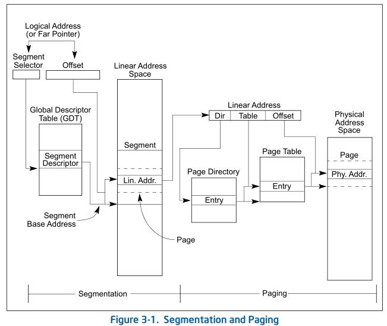
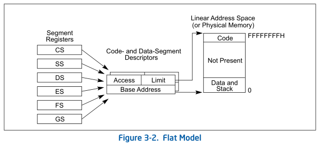
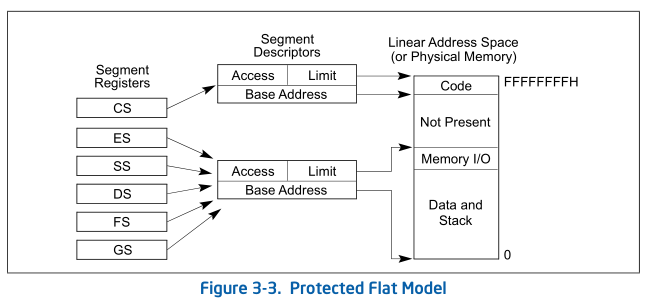
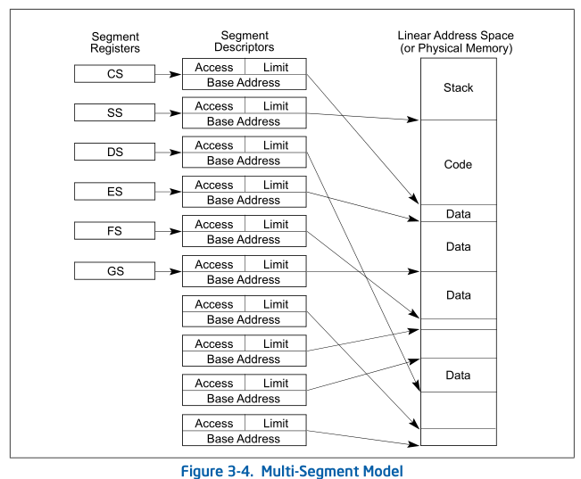
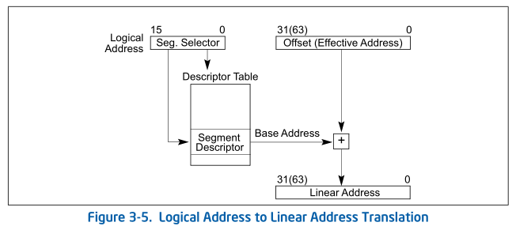
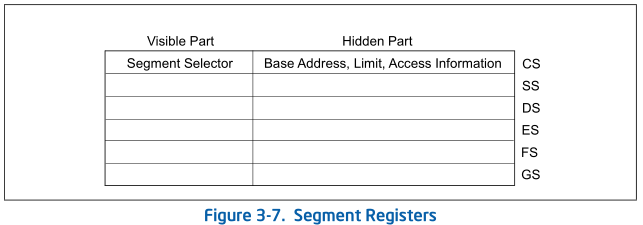
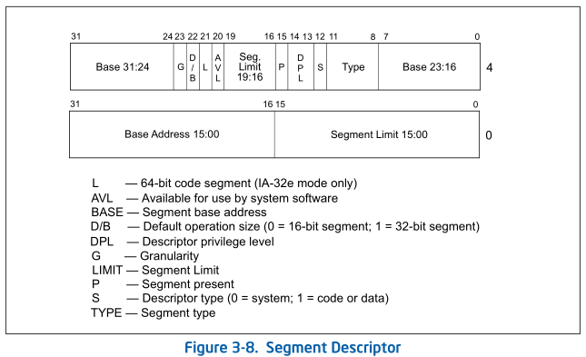

# 2.保护模式内存管理

## 2.1 内存管理概览

内存管理工具分为两部分:分段和分页。

- 分段提供了一种隔离单独代码、数据和堆栈模块的机制，以便多个程序(或任务)可以在同一处理器上运行而不相互干扰。
- 分页提供了一种实现传统的需求页虚拟内存系统的机制，在该系统中，程序执行环境的部分根据需要被映射到物理内存中。分页还可用于提供多个任务之间的隔离。在保护模式下操作时，必须使用某种形式的分段，没有模式位来禁用分段。但是，分页的使用是可选的。

这两种机制可以配置为支持简单的单任务系统、多任务系统或使用共享内存的多处理器系统。

如图3-1所示，分段提供了一种将处理器的可寻址内存空间(称为线性地址空间)划分为更小的受保护地址空间(称为段)的机制。段可以用来保存程序的代码、数据和堆栈，也可以用来保存系统数据结构(例如TSS或LDT)。

如果一个处理器上有多个程序在运行，那么每个程序都可以被分配它自己的一组段，然后处理器强化这些段之间的边界，并通过写入另一个程序的段来确保一个程序不会干扰另一个程序的执行。分段机制还允许分段的类型，这样可以限制在特定类型的分段上执行的操作。

- **物理地址（Physical Address）**：内存中实际的物理存储单元地址。

- **线性地址（Linear Address）**：逻辑地址的偏移量部分被添加到段的基址中，以定位段内的字节。基址加上偏移量在处理器的线性地址空间中形成了一个线性地址，能够指向唯一的一个物理地址。

- **逻辑地址（Logical Address）**：由段选择器和偏移量构成。

如果不使用分页，则将处理器的线性地址空间直接映射到处理器的物理地址空间。物理地址空间定义为处理器可以在其地址总线上生成的地址范围。由于多任务计算系统通常定义的线性地址空间要比一次性包含在物理内存中的经济可行性大得多，因此需要某种“虚拟化”线性地址空间的方法。这种线性地址空间的虚拟化是通过处理器的分页机制来处理的。

在使用分页时，每个段被划分为页(每个大小通常为4 KBytes)，这些页存储在物理内存中或磁盘上。操作系统或执行器维护一个页目录和一组页表来跟踪页。当程序试图访问线性地址空间中的地址位置时，处理器使用页目录和页表将线性地址转换为物理地址，然后在内存位置上执行所请求的操作。如果正在访问的页面当前不在物理内存中，通过生成页面错误异常，处理器将中断程序的执行，然后操作系统或执行程序将该页从磁盘读入物理内存，并继续执行程序。

## 2.2 分段机制

### Basic Flat Model

对于系统来说，最简单的内存模型是Basic Flat Model。在这种模型中，操作系统和应用程序可以访问连续的、未分段的地址空间。在最大程度上，这个Basic Flat Model对系统设计者和应用程序程序员隐藏了体系结构的分割机制。

如图3-2所示，要实现一个Basic Flat Model，至少创建两个段描述符，一个用于引用代码段，一个用于引用数据段。然而，这两个段都映射到整个线性地址空间，也就是说，两个段描述符具有相同的基址值0和相同的段限制4 GBytes。通过将段限制设置为4 GBytes，即使特定地址上没有物理内存，分段机制也不会因为超出限制的内存引用而产生异常。ROM (EPROM)通常位于物理地址空间的顶部，因为处理器在FFFF_FFF0H开始执行。RAM (DRAM)被放置在地址空间的底部，因为重置初始化后DS数据段的初始基址为0。

### Protected Flat Model

Protected Flat Model相对于Basic Flat Model，段限制被设置为只包括物理内存实际存在的地址范围(参见图3-3)，其次在任何访问不存在的内存的尝试上生成一个通用保护异常(#GP)。除此之外，为了让分页机制在用户和管理器代码和数据之间提供隔离，需要定义四个段，分别为用户的权限级别为3的代码和数据段，管理器的权限级别为0的代码和数据段。通常这些段都相互覆盖，并从线性地址空间的地址0开始。这种平面分割模型和简单的分页结构可以保护操作系统不受应用程序的影响，并且通过为每个任务或进程添加单独的分页结构，还可以保护应用程序不受其他应用程序的影响。一些流行的多任务操作系统也采用了类似的设计。

### Multi-Segment Model

如图3-4所示，多段模型使用分段机制的全部功能来提供对代码、数据结构、程序和任务的硬件强制保护。在这里，每个程序都有自己的段描述符表和自己的段。段可以对它们所分配的程序完全私有，也可以在程序之间共享。对系统上运行的各个程序的所有段和执行环境的访问由硬件控制。访问检查不仅可以防止在段限制之外引用地址，还可以防止在某些段中执行不允许的操作。例如，由于代码段被指定为只读段，所以硬件可以用来防止写入代码段。为分段创建的访问权限信息还可以用于设置保护环或级别。保护级别可用于保护操作系统过程免受应用程序未经授权的访问。

## 2.3 逻辑地址和线性地址的转换

如图3-5所示，为了把一个逻辑地址转换成一个线性地址，处理器做了以下步骤:
1. 使用段选择器中的偏移量来定位GDT或LDT中段的段描述符，并将其读入处理器。(只有当一个新的段选择器被加载到一个段寄存器中时，才需要这一步。)
2. 检查段描述符，以检查段的访问权限和范围，以确保段是可访问的，并且偏移量在段的限制之内。
3. 将段描述符中的段的基址添加到偏移量中以形成线性地址。
4. 如果不使用分页，处理器将线性地址直接映射到物理地址。如果对线性地址空间进行了分页，则使用第二级地址转换将线性地址转换为物理地址。

### Segment Selectors

段选择器是一个16位的段标识符(如图3-6所示)。它不直接指向这个段，而是指向定义这个段的段描述符。段选择器包含以下项:

- Index，在GDT或LDT中从8192个描述符中选择一个。处理器将索引值乘以8(段描述符中的字节数)，并将结果加到GDT或LDT的基址(分别来自GDTR或LDTR寄存器)。
- TI(Table Indicator) Flag，指定要使用的描述符表，清除此标志将选择GDT;设置此标志将选择当前的LDT。
- Requested Privilege Level (RPL)，指定选择器的特权级别。特权级别的范围从0到3，其中0是最高级别的特权级别。

GDT的第一个条目不被处理器使用，一个这个条目的段选择器(也就是说，一个索引为0并且TI标志设置为0的段选择器)被用作“空段选择器”。当一个段寄存器(CS或SS寄存器除外)装入空段选择器时，处理器不会产生异常。然而，当持有空选择器的段寄存器被用来访问内存时，它会生成一个异常。空选择器可以用来初始化未使用的段寄存器。用空段选择器加载CS或SS寄存器会生成一个通用保护异常(#GP)。

段选择器作为指针变量的一部分对应用程序可见，但选择器的值通常由链接编辑器或链接加载器分配或修改，而不是由应用程序分配或修改。

### Segment Registers

如图3-7所示，为了减少地址转换时间和编码复杂性，处理器提供了最多容纳6个段选择器的寄存器。这些段寄存器中的每一个都支持特定类型的内存引用(代码、堆栈或数据)。对于几乎任何类型的程序执行，至少代码段(CS)、数据段(DS)和堆栈段(SS)寄存器必须装入有效的段选择器。处理器还提供了三个额外的数据段寄存器(ES、FS和GS)，它们可用于为当前执行的程序(或任务)提供额外的数据段。

程序要访问段，段的段选择器必须已加载到其中一个段寄存器中。因此，尽管一个系统可以定义数千个段，但只有6个可以立即使用。其他段可以通过在程序执行期间将它们的段选择器加载到这些寄存器中来使用。

每个段寄存器都有一个“可见”部分和一个“隐藏”部分。当一个段选择器被加载到段寄存器的可见部分时，处理器也用段选择器指向的段描述符的基址、段限制和访问控制信息加载段寄存器的隐藏部分。缓存在段寄存器中的信息(可见和隐藏)允许处理器转换地址，而不需要额外的总线周期来从段描述符读取基址和限制。在多个处理器可以访问相同描述符表的系统中，当描述符表被修改时，由软件负责重新加载段寄存器。如果不这样做，缓存在段寄存器中的旧段描述符可能会在其内存驻留版本被修改后被使用。

有两种加载指令用于加载段寄存器:
1. 直接加载指令，如MOV, POP, LDS, LES, LSS, LGS和LFS指令，这些指令显式引用段寄存器。
2. 隐含的加载指令，如CALL、JMP和RET指令的远指针版本，SYSENTER和SYSEXIT指令，以及IRET、INT n、INTO、INT3和INT1指令。

### Segment Descriptors

段描述符是GDT或LDT中的一种数据结构，它向处理器提供段的大小和位置，以及访问控制和状态信息。段描述符通常由编译器、链接器、加载器或操作系统或执行器创建，而不是由应用程序创建。图3-8说明了所有类型段描述符的通用描述符格式。

- Segment limit，标识了段的大小。
- Base Address，标识了段在内存中的基地址。
- Type，标识了段的类型。
- S，标识了描述符段类型。
- DPL，标识了段的特权级别（从0到3）。
- P，标识了段是否在内存中，如果此标志被清除，则当指向段描述符的段选择器被加载到段寄存器中时，处理器将⽣成段不存在异常。
- D/B，根据段描述符是可执行代码段、向下展开数据段还是堆栈段执行不同的功能。(对于32位代码和数据段，该标志应始终设置为1，对于16位代码和数据段，该标志应始终设置为0。)
- G flag，确定段限制字段的缩放。当粒度标志为清晰时，段限制以字节单位解释;当设置flag时，段限制以4-KByte单位解释。
- L flag，指⽰代码段是否包含本机64位代码。值为1表⽰此代码段中的指令以64位模式执⾏。 值为0表⽰此代码段中的指令以兼容模式执⾏。如果设置了L位，则必须清除D位。

## 2.4 描述符的分类

### 数据段描述符 (Data segment Descriptor) & 代码段描述符 (Code segment Descriptor)

当在段描述符中设置S(描述符类型)标志时，描述符可以是代码段，也可以是数据段。然后，类型字段的最高阶位(段描述符的第二个双字的第11位)确定描述符是用于数据段(clear)还是用于代码段(set)。

对于数据段，类型字段的三个低阶位(位8,9,10)被解释为可访问(A)、可写(W)和扩展方向(E)。参见T able 3-1关于代码段和数据段的类型字段中位编码的描述。数据段可以是只读段，也可以是读写段，具体取决于写使能位的设置。

对于代码段，类型字段的三个低阶位被解释为可访问(A)、可读(R)和符合(C)。代码段可以是只执行的，也可以是执行/读的，这取决于可读位的设置。当常量或其他静态数据与指令代码一起放在ROM中时，可以使用执行/读取段。在这里，可以通过使用带有CS重写前缀的指令或通过在数据段寄存器(DS、ES、FS或GS寄存器)中加载代码段的段选择器从代码段中读取数据。在保护模式下，代码段不可写。

代码段可以是符合要求的，也可以是不符合要求的。将执行转移到更有特权的符合段允许执行继续在当前的特权级别。在不同权限级别上转移到不符合要求的代码段会导致通用保护异常(#GP)，除非使用了调用门或任务门。对于某些类型的异常(例如，分割错误或溢出)，不访问受保护的设施和处理程序的系统实用程序可以加载在符合规范的代码段中。需要保护的实用程序不受特权较低的程序和过程的影响，应该放在不符合规范的代码段中。

### SYSTEM DESCRIPTOR TYPES

这些描述符类型分为两类:系统段描述符和门描述符。系统段描述符指向系统段(LDT和TSS段)。门描述符本身就是“门”，它在代码段(调用门、中断门和陷阱门)中保存指向过程入口点的指针，或者保存TSS(任务门)的段选择器。

- 局部描述符表描述符 (Local descriptor-table(LDT) segment descriptor)：⽤于描述局部描述符表(LDT) 的属性和限制，包括表的基地址、表的限⻓等。局部描述符表可以包含多个描述符，⽤于描述不同任务的代码和数据段。
- 任务状态段描述符 (Task-state segment (TSS) descriptor)：⽤于描述任务状态段 (TSS) 的属性和限制，包括段的基地址、段的限⻓、访问权限等。任务状态段是⼀个特殊的段，⽤于保存⼀个任务的运⾏状态，包括寄存器的值、堆栈指针等。
- 调⽤⻔描述符 (Call-gate descriptor)：⽤于描述调⽤⻔的属性和限制，包括⻔的选择⼦、⽬标代码段的选择⼦、特权级等。调⽤⻔是⼀种特殊的⻔，⽤于实现跨段调⽤。
- 中断⻔描述符 (Interrupt-gate descriptor)：⽤于描述中断⻔的属性和限制，包括⻔的选择⼦、⽬标代码段的选择⼦、特权级等。中断⻔是⼀种特殊的⻔，⽤于响应硬件中断。
- 陷阱⻔描述符 (Trap-gate descriptor)：⽤于描述陷阱⻔的属性和限制，包括⻔的选择⼦、⽬标代码段的选择⼦、特权级等。陷阱⻔和中断⻔类似，但它可以在不改变特权级的情况下响应陷阱指令。
- 任务⻔描述符 (Task-gate descriptor)：⽤于描述任务⻔的属性和限制，包括⻔的选择⼦、⽬标任务的 TSS 选择⼦等。任务⻔是⼀种特殊的⻔，⽤于实现任务切换。