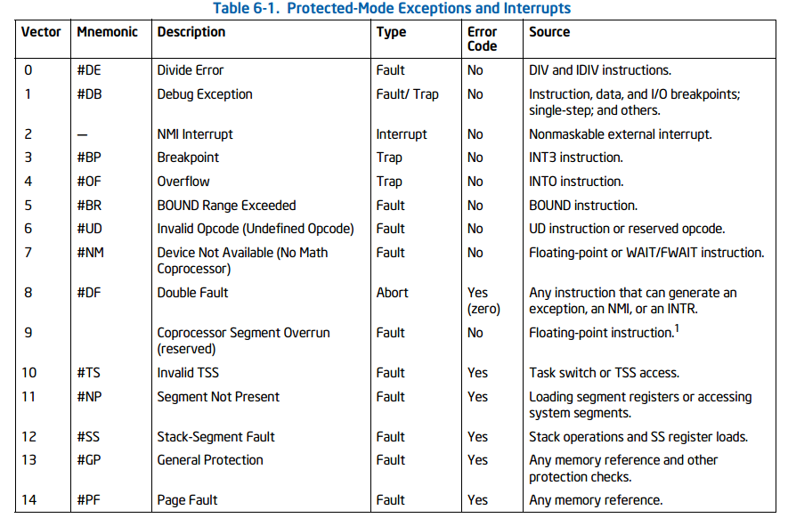
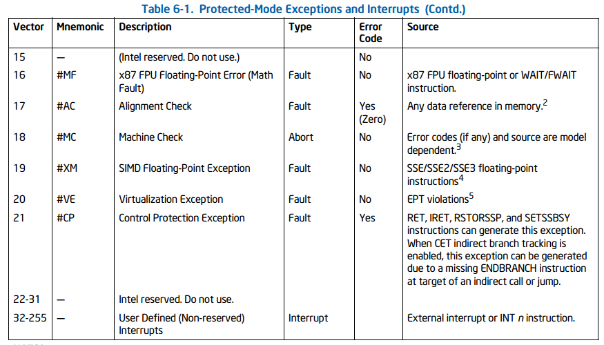
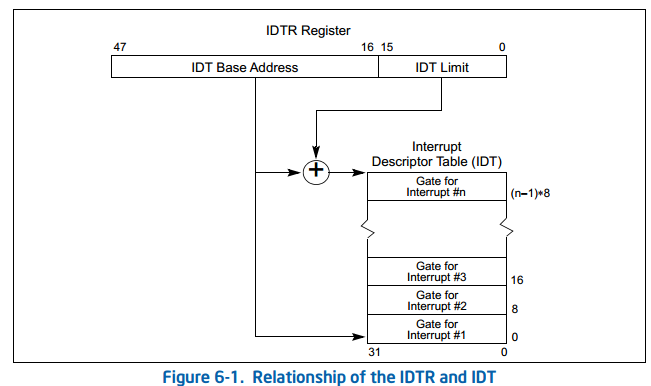
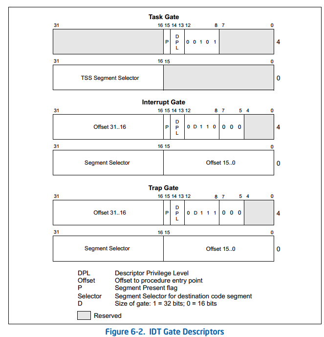
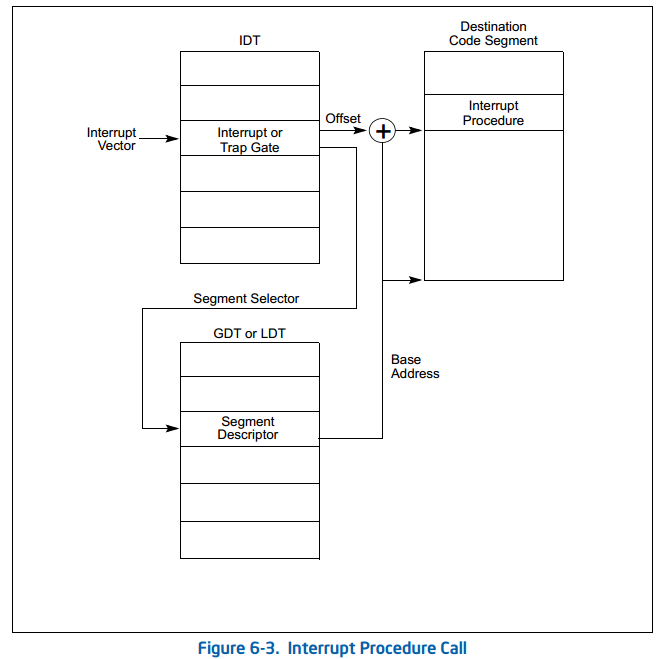
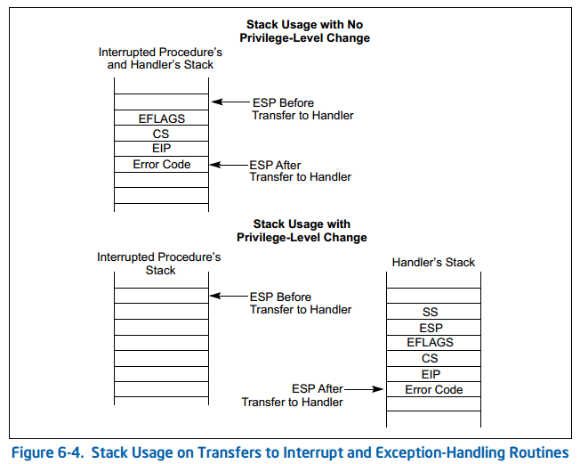
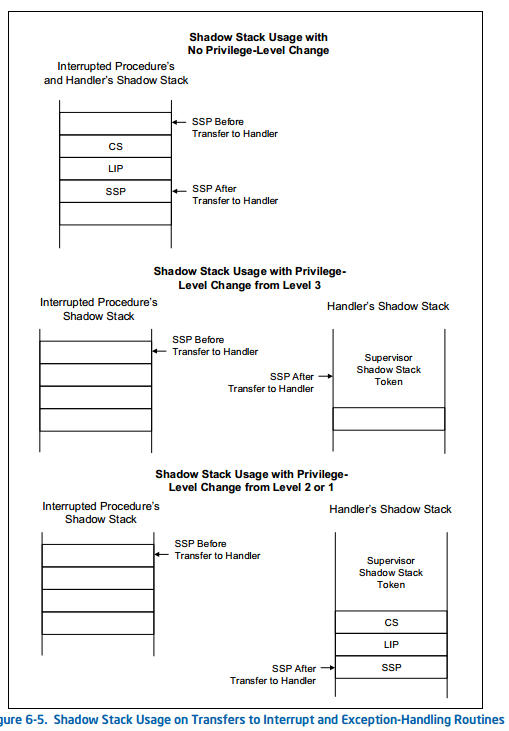
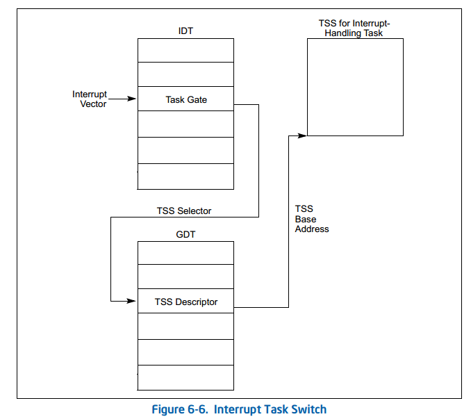

# 3.中断和异常处理

## 3.1 中断和异常处理概述

- 中断：中断在程序执行过程中随机发生，以**响应来自硬件的信号**。系统硬件使用中断来处理处理器外部的事件，例如为外围设备提供服务的请求。软件也可以通过执行INT n指令来产生中断。
- 异常：当处理器在执行指令(如除零)时检测到**错误情况**时，就会发生异常。处理器检测各种错误情况，包括保护违反、页面错误和机器内部错误。

当接收到中断或检测到异常时，当处理器执行中断或异常处理程序时，当前运行的任务被挂起。当处理程序的执行完成后，处理程序继续执行被中断的过程。被中断的任务的恢复不会失去程序的连续性，除非从异常中恢复是不可能的或中断导致当前运行的程序被终止。

## 3.2 中断和异常向量

表6-1显示了体系结构定义的异常和NMI中断的向量数分配。该表给出了异常类型，并指出是否在堆栈中保存了异常的错误代码。给出了每个预定义异常和NMI中断的来源。

为了帮助处理异常和中断，每个体系结构定义的异常和每个需要处理器特殊处理的中断条件被分配一个唯一的标识号，称为向量号。处理器使用分配给异常或中断的向量号作为中断描述符表(IDT)的索引。该表提供了异常或中断处理程序的入口点。

向量数的允许范围是0到255。从0到31的向量数由Intel 64和IA-32体系结构保留，用于体系结构定义的异常和中断。32到255范围内的向量数被指定为用户定义的中断，并且不被Intel 64和IA-32体系结构保留。这些中断通常分配给外部I/O设备，使这些设备能够通过外部硬件中断机制之一向处理器发送中断。

## 3.3 中断的来源

### 外部中断

外部中断通过处理器上的引脚或通过本地APIC接收。

当本地APIC启用时，可以通过APIC的本地向量表(LVT)对LINT[1:0]引脚进行编程，使其与任何处理器的异常或中断向量相关联。

当本地APIC为全局/硬件禁用时，这些引脚分别配置为INTR和NMI引脚。INTR引脚向处理器发出外部中断已经发生的信号，处理器从系统总线上读取由外部中断控制器提供的中断向量号，例如8259A。NMI引脚表示一个不可屏蔽中断(NMI)，它被分配给中断向量2。

### 可屏蔽硬件中断

通过INTR引脚或通过本地APIC传递给处理器的任何外部中断都称为可屏蔽硬件中断。可通过INTR引脚传送的可屏蔽硬件中断包括所有IA-32架构定义的中断向量从0到255以及可以通过本地APIC传递的包括中断向量16到255。

EFLAGS寄存器中的IF标志允许所有可屏蔽硬件中断作为一个组被屏蔽需要注意的是，当中断0到15通过本地APIC发送时，APIC表示收到了非法向量。

### 软件生成中断

INT n指令允许通过提供中断向量号作为操作数从软件内部生成中断。例如，INT 35指令强制对中断处理程序进行隐式调用。从0到255的任何中断向量都可以用作此指令中的参数。但是，如果使用处理器预定义的NMI向量，则处理器的响应将与以正常方式生成的NMI中断的响应不同。如果在这个指令中使用了2号向量(NMI向量)，则调用NMI中断处理程序，但是处理器的NMI处理硬件没有被激活。

除此之外，用INT n指令在软件中产生的中断不能被EFLAGS寄存器中的IF标志所掩盖。

## 3.4 异常的来源

### 程序错误异常

处理器在应用程序或操作系统或执行程序的执行过程中检测到程序错误时，会产生一个或多个异常。Intel 64和IA-32体系结构为每个处理器可检测的异常定义了一个向量数。异常分为故障、陷阱和中止。

### 软件生成异常

INTO、INT1、INT3和BOUND指令允许在软件中生成异常。这些指令允许在指令流中的点执行异常条件检查。例如，INT3导致生成断点异常。

INT n指令可用于模拟软件中的异常，但这是有限制的，如果INT n为一个体系结构定义的异常提供了一个向量，处理器将对正确的向量生成一个中断(以访问异常处理程序)，但不会在堆栈上推送错误代码。即使相关的硬件生成的异常通常产生错误代码，也是如此。异常处理程序在处理异常时仍将尝试从堆栈中弹出错误代码。由于没有推送错误代码，处理程序将弹出并丢弃EIP(代替丢失的错误代码)，**这将返回到错误的位置**。

### 机器检查

当检测到机器检查错误时，处理器发出机器检查异常信号(向量18)并返回错误代码。

## 3.5 异常的分类

根据异常的报告方式以及引起异常的指令是否可以在不丢失程序或任务连续性的情况下重新启动，异常被分为故障、陷阱或中止。

- 故障：故障是一种异常，通常可以纠正，一旦纠正，允许程序重新启动，而不会失去连续性。当故障被报告时，处理器将机器状态恢复到开始执行故障指令之前的状态。**故障处理程序的返回地址(CS和EIP寄存器保存的内容)指向故障指令，而不是指向故障指令之后的指令。**
- 陷阱：陷阱是在执行陷阱指令后立即报告的异常。陷阱允许继续执行程序或任务而不会失去程序的连续性。陷阱处理程序的返回地址指向在**陷阱指令之后要执行的指令**。
- 中止：中止是一种异常，它不总是报告导致异常的指令的精确位置，也**不允许重新启动导致异常的程序或任务**。中止用于报告严重的错误，例如硬件错误和系统表中不一致或非法的值。

## 3.6 重新启动程序或任务

为了允许在处理异常或中断后重新启动程序或任务，所有异常(中止除外)都保证在指令边界上报告异常。所有中断都保证发生在指令边界上。

对于故障类异常，**返回指令指针(在处理器生成异常时保存)指向错误指令**。因此，当程序或任务在处理故障后重新启动时，错误指令将重新启动(重新执行)。重新启动故障指令通常用于处理对操作数的访问被阻塞时生成的异常。这种类型的错误最常见的例子是页面错误异常(#PF)，当程序或任务引用位于不在内存中的页面上的操作数时发生。当出现页面错误异常时，异常处理程序可以将页面加载到内存中，并通过重新启动错误指令来恢复程序或任务的执行。为了确保对当前正在执行的程序或任务透明地处理重新启动，处理器保存必要的寄存器和堆栈指针，以允许在执行错误指令之前重新启动到状态。

对于陷阱类异常，**返回指令指针指向跟踪捕获指令的指令**。如果在转移执行的指令期间检测到陷阱，则返回指令指针反映转移。例如，如果在执行JMP指令时检测到陷阱，则返回指令指针指向JMP指令的目标，而不是指向JMP指令之后的下一个地址。所有的陷阱异常都允许程序或任务重新启动而不会失去连续性。

对于中止类异常，其不支持可靠地重新启动程序或任务。中止处理程序的设计目的是在发生中止异常时收集有关处理器状态的诊断信息，然后尽可能优雅地关闭应用程序和系统。

## 3.7 不可屏蔽中断(NMI)

不可屏蔽中断(NMI)可以通过两种方式产生:
- 外部硬件Assert NMI引脚。
- 处理器在系统总线或APIC串行总线上接收具有交付模式NMI的消息。

当处理器从这些源中的任何一个接收到NMI时，处理器立即通过调用中断向量2所指向的NMI处理器来处理它。处理器还调用特定的硬件条件，以确保在NMI处理程序完成执行之前不会接收到其他中断，包括NMI中断。

此外，当从上述任何一个源接收NMI时，它不能被EFLAGS寄存器中的IF标志所掩盖。

可以向向量2发出一个可屏蔽的硬件中断(通过INTR引脚)来调用NMI中断处理程序，但是，这个中断将不是真正的NMI中断。激活处理器NMI处理硬件的真正NMI中断只能通过上面列出的一种机制来传递。

当NMI中断处理程序正在执行时，处理器阻塞后续NMI的传递，直到下一个IRET指令执行，IRET指令的执行解除了NMI的阻塞，即使该指令导致了错误。例如，如果IRET指令与EFLAGS一起执行。VM = 1且IOPL小于3，则产生一般保护异常(参见21.2.7“敏感指令”)。在这种情况下，NMI在调用异常处理程序之前被揭开。

## 3.8 启用和禁用中断

### 屏蔽可屏蔽的硬件中断

IF标志可以禁用从处理器的INTR引脚或通过本地APIC接收的可屏蔽硬件中断的服务。当清除IF标志时，处理器禁止发送到INTR引脚的中断或通过本地APIC产生内部中断请求的中断;当设置IF标志时，传递给INTR或通过本地APIC引脚的中断被当作正常的外部中断处理。

IF标志不影响传递到NMI引脚的非掩码中断(NMI)或通过本地APIC传递的NMI消息的传递模式，也不影响处理器生成的异常。与EFLAGS寄存器中的其他标志一样，处理器清除IF标志以响应硬件复位。

IF标志可以通过STI和CLI指令分别设置或清除。只有当CPL等于或小于IOPL时，才能执行这些指令。如果在CPL大于IOPL时执行，则会生成一个通用保护异常(#GP)。如果IF=0，则在执行了STI之后，可屏蔽硬件中断在指令边界上仍然被抑制。

IF标志还受到以下操作的影响:
- PUSHF指令将所有标志存储在堆栈中，在那里它们可以被检查和修改。POPF指令可用于将修改后的标志加载回EFLAGS寄存器。
- 任务切换和POPF和IRET指令加载EFLAGS寄存器;因此，它们可以用来修改IF标志的设置。
- 当中断通过中断门处理时，IF标志被自动清除，这会禁用可屏蔽的硬件中断。

### 屏蔽指令断点

EFLAGS寄存器中的RF(恢复)标志控制处理器对指令断点条件的响应。
当设置RF标志时，它防止指令断点生成调试异常(#DB)。当清楚RF标志时，指令断点将生成调试异常。RF标志的主要功能是防止处理器在指令断点上进入调试异常循环。

如第6.8.3节所述，执行MOV或POP指令来加载SS寄存器会抑制下一条指令上的任何指令断点(就像EFLAGS一样)。(当RF为1)。

###  在切换堆栈时屏蔽异常和中断

为了切换到不同的堆栈段，软件通常使用一对指令，例如:MOV SS, AX MOV ESP等。如果一个中断或异常发生在新的SS段描述符被加载之后，但是在ESP寄存器被加载之前，在中断或异常处理程序的持续时间内，这两个部分的逻辑地址进入堆栈空间是不一致的(假设中断或异常的传递本身没有加载一个新的堆栈指针)。

为了解决这种情况，处理器阻止在执行MOV到SS指令或POP到SS指令后传递某些事件：
- 在下一条指令上的任何指令断点都被抑制(就像EFLAGS一样)。(当RF为1)。
- 在MOV到SS指令或POP到SS指令上的任何数据断点都被抑制，直到下一条指令之后的指令边界。
- 根据MOV到SS指令或POP到SS指令(因为EFLAGS.TF为1)交付的任何单步陷阱被抑制。
- 抑制在传递异常或执行下一条指令后结束。
- 如果一个连续的指令序列每个加载SS寄存器(使用MOV或POP)，只有第一个保证以这种方式抑制事件。

## 3.9 异常和中断的优先级

如果在指令边界(指令执行之间)有多个事件挂起，处理器将以可预测的顺序为它们提供服务。

| 优先级 | 描述|
| --- | --- |
|1|硬件Reset和机器检查|
|2|Task Switch的线性，如TSS的T flag被设置|
|3|外部硬件干预，如FLUSH、STOPCLK、SMI、INIT|
|4|上一条指令的陷阱，如陷阱类调试异常|
|5|NMI|
|6|可屏蔽的硬件中断|
|7|错误类调试异常(#DB由于指令断点)|
|8|获取下一条指令的错误，如代码段限制违反(#GP)、代码页错误(#PF)|
|9|解码下一条指令的错误|

## 3.10 中断描述符表IDT

中断描述符表(IDT)将每个异常或中断向量与用于服务相关异常或中断的过程或任务的门描述符相关联。与GDT和IDT一样，IDT是一个8字节的描述符数组(在保护模式下)。与GDT不同，IDT的第一个条目可能包含一个描述符。为了形成IDT的索引，处理器将异常或中断向量按8(门描述符中的字节数)进行缩放。因为只有256个中断或异常向量，所以IDT不需要包含超过256个描述符。它可以包含少于256个描述符，因为只有可能发生的中断和异常向量才需要描述符。IDT中的所有空描述符槽都应该将描述符的当前标志设置为0。

IDT的**基址**应该在8字节的边界上对齐，以最大化缓存线填充的性能。限制值以字节表示，并将其添加到基址中以**获得最后一个有效字节的地址**。

**LIDT**(加载IDT寄存器)和**SIDT**(存储IDT寄存器)指令分别加载和存储IDTR寄存器的内容。LIDT指令将保存在内存操作数中的基址和限制加载到IDTR寄存器中。该指令只能在CPL为0时执行。在创建IDT时，它通常由操作系统的初始化代码使用。操作系统也可以使用它从一个IDT切换到另一个IDT。SIDT指令将存储在IDTR中的基值和限制值复制到内存中。该指令可以在任何特权级别上执行。

如果一个向量引用的描述符超出了IDT的限制，就会生成一个通用保护异常(#GP)。

## 3.11 IDT描述符

IDT可以包含三种门描述符中的任何一种(图6-2显示了任务门、中断门和陷阱门描述符的格式):
- 任务门描述符
- 中断门描述符
- 陷阱门描述符

IDT中使用的任务门的格式与GDT或LDT中使用的任务门的格式相同，任务门包含用于异常或中断处理程序任务的TSS的段选择器。

中断门和陷阱门与调用门非常相似。它们包含一个远指针(段选择器和偏移量)，处理器使用它将程序执行转移到异常或中断处理程序代码段中的处理程序过程。这些门的不同之处在于处理器在EFLAGS寄存器中处理IF标志的方式。

## 3.12 异常和中断处理

### 异常或中断处理程序

中断门或陷阱门引用在当前执行任务的上下文中运行的异常或中断处理程序(参见图6-3)。门的段选择器指向GDT或当前LDT中可执行代码段的段描述符。门描述符的偏移字段指向异常或中断处理过程的开始。

当处理器执行对异常或中断处理程序过程的调用时:
- 如果处理程序过程将在较低的数字权限级别上执行，则会发生堆栈交换。

- 当发生堆栈切换时:
  - 处理程序要使用的堆栈的段选择器和堆栈指针从当前执行的任务的TSS中获得。在这个新的堆栈上，处理器推送被中断过程的堆栈段选择器和堆栈指针。
  - 处理器将EFLAGS、CS和EIP寄存器的当前状态保存到新的堆栈中(如图6-4所示)。
  - 如果异常导致错误码被保存，则将错误码压入EIP值之后的新堆栈。

- 如果处理程序过程将以与被中断过程相同的特权级别执行:
  - 处理器保存当前堆栈上的EFLAGS, CS和EIP寄存器的当前状态(见图6-4)。
  - 如果异常导致错误码被保存，则将错误码压入EIP值之后的当前堆栈。

**要从异常处理程序或中断处理程序中返回，处理程序必须使用IRET(或IRETD)指令**。

IRET指令与RET指令类似，但它会将保存的标志恢复到EFLAGS寄存器中。只有当CPL为0时，EFLAGS寄存器的IOPL字段才会恢复。只有当CPL小于或等于IOPL时，IF标志才会被改变。

如果在调用处理程序过程时发生堆栈切换，则IRET指令在返回时切换回被中断过程的堆栈。

---

当处理器执行对异常或中断处理程序过程的调用时:
- 如果处理程序过程将在数字较低的特权级别上执行，则会发生影子堆栈切换。当发生影子堆栈切换时:
  - 在从特权级别3传输时，如果在特权级别3启用了影子堆栈，则SSP将保存到IA32_PL3_SSP MSR中。
  - 如果在处理程序将要执行的特权级别上启用了影子堆栈，则根据处理程序执行的特权级别，从以下msr之一获得处理程序的影子堆栈。
    - A32_PL2_SSP如果处理器在特权级别2执行。
    - IA32_PL1_SSP如果处理程序在特权级别1执行。
    - IA32_PL0_SSP如果处理程序在特权级别0执行。
  - 然后验证获得的SSP，通过验证SSP指向的地址上的监督影子堆栈令牌，确保它指向一个有效的当前未激活的监督影子堆栈。
  - 在这个新的影子堆栈上，处理器推送CS, LIP(CS.base+ESP)，如果中断过程在特权级别小于3的情况下执行，则中断过程的SSP;
  
- 如果处理程序过程将以与中断过程相同的特权级别执行，并且在当前特权级别启用影子堆栈:
  - 处理器保存CS的当前状态，LIP(CS.base+ESP)和SSP寄存器在当前阴影堆栈上;

当从中断或异常处理程序从与被中断过程相同的特权级别执行返回时，处理器执行这些操作来强制返回地址保护:
- 将CS和EIP寄存器恢复到中断或异常之前的值。如果使用了影子堆栈：将影子地址SSP+8(LIP)和SSP+16(CS)的值和CS进行比较，然后(CS.base+EIP)弹出栈，如果不匹配的话会扔出控制保护异常(#CP(FAR-RET/IRET))。

当从不同于被中断过程的特权级别执行中断或异常处理程序的返回时，处理器执行以下操作：
- 如果在当前权限级别启用了影子堆栈:
  - 如果SSP没有对齐到8字节，则会导致控制保护异常(#CP(FAR-RET/IRET))。
  - 如果返回到的进程的特权级别小于3(返回到supervisor模式):
    - 将影子地址SSP+8(LIP)和SSP+16(CS)的值和CS进行比较，然后(CS.base+EIP)弹出栈，如果不匹配的话会扔出控制保护异常(#CP(FAR-RET/IRET))。
    - 在内部临时保存栈顶值(被返回的过程的SSP)。
  - 如果地址SSP+24上存在繁忙的监督器影子堆栈令牌，则将令牌标记为空闲。
  - 如果返回到的进程的权限级别小于3(返回到supervisor模式)，则从内部保存的值恢复SSP寄存器。
  - 如果返回到的过程的权限级别为3(返回到用户模式)，并且在权限级别为3的情况下启用了影子堆栈，则恢复SSP寄存器的值为IA32_PL3_SSP MSR

---

异常处理程序和中断处理程序的特权级保护类似于通过调用门调用的普通过程调用。处理器不允许将执行转移到比CPL权限更小的代码段中的异常或中断处理程序过程。试图违反此规则会导致通用保护异常(#GP)。异常处理程序和中断处理程序的保护机制在以下方面有所不同:

- 因为中断和异常向量没有RPL，所以在对异常和中断处理程序的隐式调用时不检查RPL。
- 只有当异常或中断由INT n、INT3或INTO指令产生时，处理器才检查中断或陷阱门的DPL。

由于异常和中断通常不会在可预测的时间发生，因此这些特权规则有效地对运行异常和中断处理过程的特权级别施加了限制。可以使用以下任何一种技术来避免特权级违规：

- 异常或中断处理程序可以放置在一个符合的代码段。此技术可用于只需要访问堆栈上可用数据的处理程序(例如，划分错误异常)。如果处理程序需要来自数据段的数据，则需要从特权级别3访问该数据段，这将使其不受保护。
- 处理程序可以放置在特权级别为0的不符合代码段中。无论被中断的程序或任务运行在哪个CPL上，这个处理程序都将始终运行。

---

当通过中断门或陷阱门访问异常或中断处理程序时，处理器在将EFLAGS寄存器的内容保存在堆栈上之后清除EFLAGS寄存器中的**TF标志**。(在调用异常和中断处理程序时，处理器还清除EFLAGS寄存器中的**VM、RF和NT标志**，然后将它们保存在堆栈上。)清除TF标志可以防止指令跟踪影响中断响应，并确保在传递给处理程序后不会传递单步异常。随后的IRET指令将TF(以及VM、RF和NT)标志恢复为堆栈上EFLAGS寄存器保存的内容中的值。

**中断门和陷阱门之间的唯一区别是处理器在EFLAGS寄存器中处理IF标志的方式不同**。当通过中断门访问异常或中断处理过程时，处理器清除IF标志以防止其他中断干扰当前中断处理程序。随后的IRET指令将IF标志恢复为堆栈上EFLAGS寄存器中保存的内容中的值。通过陷阱门访问处理程序过程不会影响IF标志。

### 中断任务

当通过IDT中的任务门访问异常或中断处理程序时，就会产生任务切换。用单独的任务处理异常或中断提供了几个优点:

- 被中断的程序或任务的整个上下文被自动保存。
- 新的TSS允许处理程序在处理异常或中断时使用新的特权级别0堆栈。如果在当前特权级别0堆栈损坏时发生异常或中断，通过任务门访问处理程序可以通过向处理程序提供新的特权级别0堆栈来防止系统崩溃。
- 处理程序可以通过给它一个单独的地址空间来进一步与其他任务隔离。这是通过给它一个单独的LDT来完成的。

用单独的任务处理中断的缺点是，必须在任务开关上保存的机器状态的数量使其比使用中断门慢，从而导致中断延迟增加。

IDT中的任务门引用GDT中的TSS描述符(参见图6-6)。切换到处理程序任务的处理方式与普通任务切换相同。返回到中断任务的链接存储在处理程序任务的TSS的前一个任务链接字段中。如果异常导致错误码生成，则该错误码将被复制到新任务的堆栈中。

当在操作系统中使用异常或中断处理程序任务时，实际上有两种机制可用于分派任务:软件调度器(操作系统的一部分)和硬件调度器(处理器中断机制的一部分)。软件调度器需要适应中断任务，当中断被启用时，中断任务可能被分派。