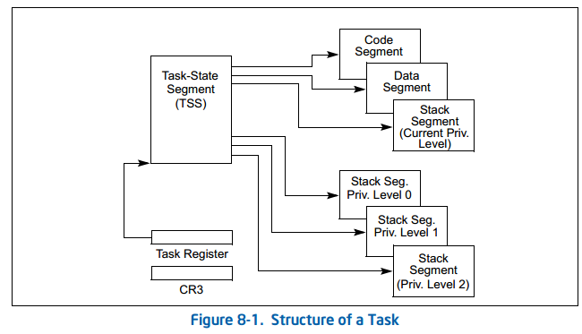
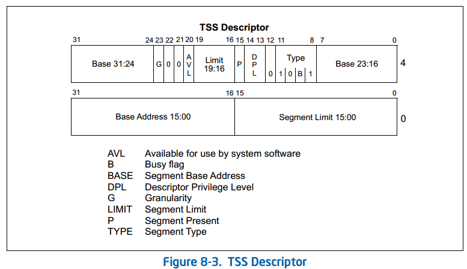
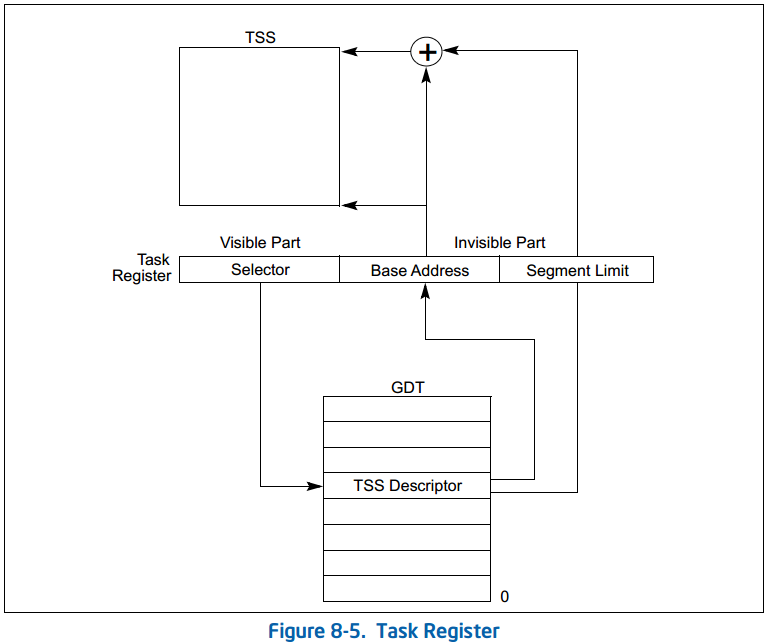
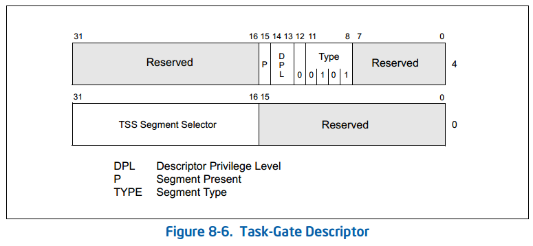
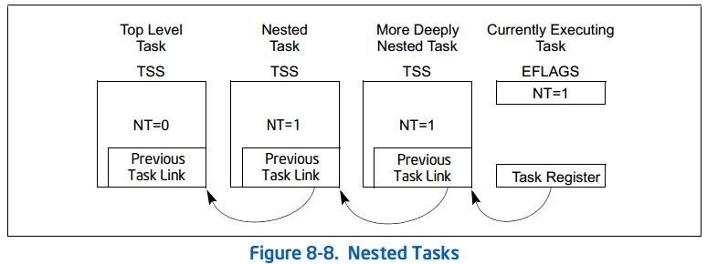
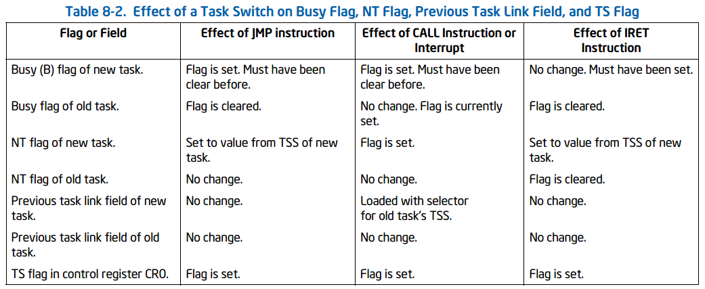
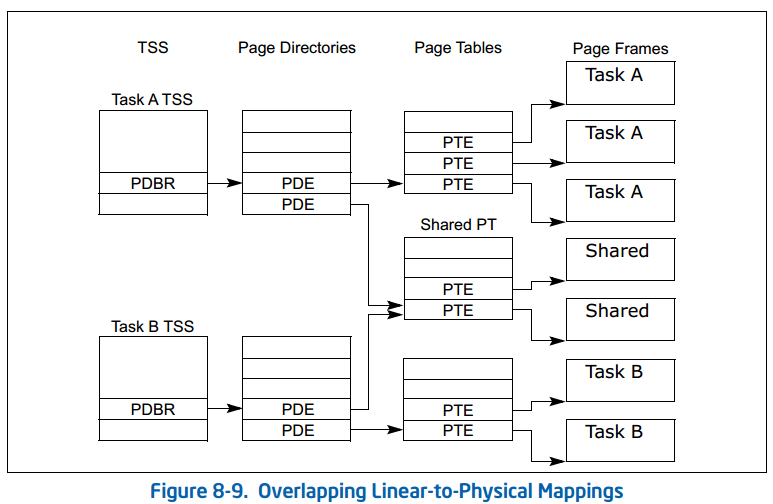

# 4.任务管理

## 4.1 任务管理概述

### 4.1.1 任务的结构

任务由两部分组成：任务执行空间和任务状态段（TSS）。任务执行空间由**一个代码段**、**一个堆栈段**和**一个或多个数据段**组成（见图8-1）。如果操作系统或执行程序使用处理器的特权级别保护机制，则任务执行空间还为每个特权级别提供单独的堆栈。TSS则指定组成任务执行空间的段，并为任务状态信息提供存储位置。在多任务系统中，TSS还提供了一种用于链接任务的机制。
任务由其TSS的段选择器标识。当任务被加载到处理器中执行时，TSS的段选择器、基地址、限制和段描述符属性被加载到任务寄存器中。如果对任务执行分页，则将任务使用的分页目录的基地址加载到控制寄存器CR3中。

### 4.1.2 任务状态

以下项目定义了当前执行任务的状态：
- 任务的当前执行空间，由段寄存器（CS、DS、SS、ES、FS和GS）中的段选择器定义。
- 通用寄存器的状态。
- EFLAGS寄存器的状态。
- EIP寄存器的状态。
- 控制寄存器CR3的状态。
- 任务寄存器的状态。
- LDTR寄存器的状态。
- I/O映射基本地址和I/O映射（包含在TSS中）。
- 指向特权0、1和2堆栈（包含在TSS中）的堆栈指针。
- 链接到先前执行的任务（包含在TSS中）。
- 影子堆栈指针（SSP）的状态。

在调度任务之前，除任务寄存器的状态外，所有这些项都包含在任务的TSS中。此外，LDTR寄存器的完整内容不包含在TSS中，只包含在LDT的段选择器中。

### 4.1.3 任务的执行

软件或处理器可以通过以下方式之一调度任务执行：
- 使用call指令显式调用任务。
- 使用JMP指令显式跳转到任务。
- 对中断处理程序任务的隐式调用（由处理器执行）。
- 对异常处理程序任务的隐式调用。
- 设置EFLAGS寄存器中的NT标志时的返回（由IRET指令启动）。

所有这些用于调度任务的方法都使用指向任务门或任务TSS的段选择器来标识要调度的任务。当使用CALL或JMP指令调度任务时，指令中的选择器可以直接选择TSS，也可以选择用于保存TSS选择器的任务门。

当任务被调度执行时，在当前运行的任务和调度的任务之间会发生任务切换。在任务切换期间，当前正在执行的任务的执行环境（称为任务的状态或上下文）保存在其TSS中，并暂停任务的执行。然后将调度任务的上下文加载到处理器中，并从新加载的EIP寄存器指向的指令开始执行该任务。如果自上次初始化系统以来，任务尚未运行，则EIP将指向任务代码的第一条指令；否则，它将指向任务上次活动时执行的最后一条指令之后的下一条指令。

如果当前正在执行的任务（调用任务）调用了正在调度的任务（被调用任务），则调用任务的TSS段选择器存储在被调用任务的TSA中，以提供返回调用任务的链接。

对于所有IA-32处理器，任务都不是递归的。任务不能调用或跳转到自身。

中断和异常可以通过任务切换到处理程序任务来处理。这里，处理器执行任务切换以处理中断或异常，并在从中断处理程序任务或异常处理程序任务返回时自动切换回被中断的任务。该机制还可以处理在中断任务期间发生的中断。

作为任务切换的一部分，处理器还可以切换到另一个LDT，允许每个任务具有不同的基于LDT的段的逻辑到物理地址映射。页面目录基寄存器（CR3）也在任务交换机上重新加载，允许每个任务都有自己的一组页面表。这些保护设施有助于隔离任务并防止它们相互干扰。

如果不使用保护机制，则处理器在任务之间不提供保护。即使使用多个权限级别进行保护的操作系统也是如此。以特权级别3运行的任务与其他特权级别3的任务使用相同的LDT和页表，该任务可能会访问代码并损坏数据和其他任务的堆栈。

使用任务管理设施来处理多任务应用程序是可选的。多任务处理可以在软件中进行，每个软件定义的任务都在单个IA-32体系结构任务的上下文中执行。

如果启用了影子堆栈，则任务的SSP位于32位TSS中偏移104处的4个字节处，并且当与该TSS相关联的任务发生任务切换时，处理器使用该SSP来建立SSP。请注意，处理器不会将启动任务切换的任务的SSP写入该任务的TSS，而是将上一个任务的SSP推送到新任务的影子堆栈上

## 4.2 任务的数据结构

Q: 任务状态段 Task-State Segment (TSS)
A: 

恢复任务所需的处理器状态信息保存在称为任务状态段（TSS）的系统段中。TSS的字段分为两大类：动态字段和静态字段。当任务在任务切换期间暂停时，处理器会更新动态字段。以下是动态字段：
- 通用寄存器字段
- 段选择器字段
- EFLAGS寄存器字段
- EIP(指令指针)字段
- 上一个任务链接字段

处理器读取静态字段，但通常不会更改它们。这些字段是在创建任务时设置的。以下是静态字段：
- LDT段选择器字段
- CR3控制寄存器字段
- 特权级别0、-1和-2堆栈指针字段
- T(调试陷阱)标志(字节100，位0)
- I/O映射基本地址字段
- 卷影堆栈指针(SSP)

如果使用分页：
- 与上一个任务的TSS、当前任务的TSS和每个任务的描述符表条目相对应的页面应标记为读/写。
- 如果在启动任务切换之前，内存中存在包含这些结构的页面，则任务切换执行得更快。

---

Q: TSS 描述符
A: 

TSS和所有其他段一样，由段描述符定义。图8-3显示了TSS描述符的格式。TSS描述符只能放在GDT中；它们不能被放置在LDT或IDT中。

使用设置了TI标志（指示当前LDT）的段选择器访问TSS的尝试导致在CALL和JMP期间生成一般保护异常（#GP）；它在IRET期间导致无效的TSS异常（#TS）。如果试图将TSS的段选择器加载到段寄存器中，也会生成一般保护异常。

类型字段中的忙标志（B）指示任务是否忙。繁忙的任务当前正在运行或已挂起。值为1001B的类型字段表示非活动任务；1011B的值表示繁忙的任务。任务不是递归的。处理器使用忙标志来检测调用其执行已中断的任务的尝试。为了确保只有一个繁忙标志与任务相关联，每个TSS应该只有一个指向它的TSS描述符。

任何可以访问TSS描述符的程序或过程（即其CPL在数字上等于或小于TSS描述符中的DPL）都可以通过调用或跳转来调度任务。

在大多数系统中，TSS描述符的DPL设置为小于3的值，因此只有特权软件才能执行任务切换。然而，在多任务应用程序中，一些TSS描述符的DPL可以设置为3，以允许在应用程序（或用户）特权级别进行任务切换。

---

Q: 任务寄存器
A: 

任务寄存器保存当前任务TSS的16位段选择器和整个段描述符。此信息是从当前任务的GDT中的TSS描述符中复制的。图8-5显示了处理器用于访问TSS的路径（使用任务寄存器中的信息）。

任务寄存器有一个可见部分（可以由软件读取和更改）和一个不可见部分（由处理器维护，软件无法访问）。可见部分中的段选择器指向GDT中的TSS描述符。处理器使用任务寄存器的不可见部分来缓存TSS的段描述符，将这些值缓存在寄存器中可以提高任务的执行效率。LTR（加载任务寄存器）和STR（存储任务寄存器）指令加载和读取任务寄存器的可见部分：
- LTR指令将段选择器（源操作数）加载到指向GDT中TSS描述符的任务寄存器中。然后，它用TSS描述符中的信息加载任务寄存器的不可见部分。LTR是一种特权指令，只有当CPL为0时才能执行。它在系统初始化期间用于将初始值放入任务寄存器。然后，当任务切换发生时，任务寄存器的内容被隐式地改变。

- STR（存储任务寄存器）指令将任务寄存器的可见部分存储在通用寄存器或存储器中。此指令可以由以任何特权级别运行的代码执行，以便识别当前正在运行的任务。然而，它通常仅由操作系统软件使用。（如果CR4.UMIP=1，则只有当CPL=0时才能执行STR。）在处理器上电或复位时，段选择器和基址设置为默认值0；限制被设置为FFFFH。

---

Q: 任务门描述符 Task-Gate Descriptor
A: 

任务门描述符提供了对任务的间接、受保护的引用(见图8-6)。它可以放置在GDT、LDT或IDT中。任务门描述符中的TSS段选择器字段指向GDT中的TSSs描述符。未使用此段选择器中的RPL。

任务门描述符的DPL控制在任务切换期间对TSS描述符的访问。当程序或过程通过任务门调用或跳转到任务时，指向任务门的门选择器的CPL和RPL字段必须小于或等于任务门描述符的DPL。请注意，当使用任务门时，不使用目标TSS描述符的DPL。

可以通过任务门描述符或TSS描述符访问任务。这两种结构都满足以下需求：
- 需要一个任务只有一个忙标志
- 需要提供对任务的选择性访问
- 需要由独立任务处理中断或异常

图8-7说明了LDT中的任务门、GDT中的工作门和IDT中的一个工作门如何都指向同一个任务。

---

## 4.3 任务切换

Q: 什么时候发生任务切换
A:

在以下四种情况之一中，处理器将执行转移到另一个任务：
- 当前程序、任务或过程执行对GDT中TSS描述符的JMP或CALL指令。
- 当前程序、任务或过程对GDT或当前LDT中的任务门描述符执行JMP或CALL指令。
- 中断或异常向量指向IDT中的任务门描述符。
- 当EFLAGS寄存器中的NT标志被设置时，当前任务执行IRET。

---

Q: 发生任务切换时，处理器会执行哪些操作？
A:

处理器在切换到新任务时执行以下操作：
1. 从任务门或上一个任务链接字段（对于用IRET指令启动的任务切换）获取新任务的TSS段选择器作为JMP或CALL指令的操作数。
2. 检查是否允许当前（旧）任务切换到新任务。
3. 检查新任务的TSS描述符是否标记为存在并且具有有效限制（大于或等于67H）。如果任务切换是由IRET启动的，并且在当前CPL启用了影子堆栈，则SSP必须与8个字节对齐，否则将生成#TS（当前任务TSS）故障。如果CR4.CET为1，则TSS必须是32位TSS，并且新任务的TSS的限制必须大于或等于107字节，否则将生成#TS（新任务TSS）故障。
4. 检查新任务是否可用（调用、跳转、异常或中断）或繁忙（IRET返回）。
5. 检查任务交换机中使用的当前（旧）TSS、新TSS和所有段描述符是否已分页到系统内存中。
6. 将当前（旧）任务的状态保存在当前任务的TSS中。处理器在任务寄存器中找到当前TSS的基址，然后将以下寄存器的状态复制到当前TSS中：所有通用寄存器、段寄存器中的段选择器、EFLAGS寄存器的临时保存映像以及指令指针寄存器（EIP）。
7. 为新任务的TSS加载带有段选择器和描述符的任务寄存器。
   - 如果启用了CET，处理器将执行影子堆栈操作。
   - TSS状态已加载到处理器中。这包括LDTR寄存器、PDBR（控制寄存器CR3）、EFLAGS寄存器、EIP寄存器、通用寄存器和段选择器。加载此状态期间的故障可能会破坏体系结构状态。（如果未启用分页，则会从新任务的TSS中读取PDBR值，但不会将其加载到CR3中。）
   - 如果任务切换是用JMP或IRET指令启动的，则处理器清除当前（旧）任务的TSS描述符中的忙（B）标志；如果是用CALL指令、异常或中断启动的：则保留忙碌（B）标志。（见表8-2）
   - 如果任务切换是用IRET指令启动的，则处理器清除EFLAGS寄存器的临时保存映像中的NT标志；如果使用CALL或JMP指令、异常或中断启动，则保存的EFLAGS映像中的NT标志保持不变。
   - 如果任务切换是用CALL指令、异常或中断启动的，则处理器将在从新任务加载的EFLAGS中设置NT标志。如果用IRET指令或JMP指令启动，NT标志将反映从新任务加载的EFLAGS中NT的状态（见表8-2）。
   - 如果任务切换是用CALL指令、JMP指令、异常或中断启动的，则处理器在新任务的TSS描述符中设置忙（B）标志；如果用IRET指令启动，则忙（B）标志保留设置。
8. 加载并限定与分段选择器相关联的描述符。与此加载和鉴定相关的任何错误都会发生在新任务的上下文中，并可能破坏体系结构状态。
    - 如果启用了CET，则处理器执行以下影子堆栈操作。
9.  开始执行新任务。

---

Q: 中断或异常向量指向IDT表中的中断门或陷阱门，会发生任务切换吗？
A: 不发生任务切换；当中断或异常向量指示了一个任务门时才引起任务切换。

---

## 4.4 任务链

Q: 如何判断任务是否嵌套？
A:

EFLAGS.NT=1表示当前正在执行的任务嵌套在另一个任务的执行中。

---

Q: 什么情况会发生任务嵌套？
A:

当CALL指令、中断或异常导致任务切换时，处理器将当前TSS的段选择器复制到新任务的TSS的前一个任务链接字段；然后将EFLAGS.NT设置为1。

---

Q: 任务嵌套时修改了哪些标志位？
A: 

---

Q: 任务嵌套时，如何返回前一任务？
A:

如果软件使用IRET指令来挂起新任务，则处理器检查EFLAGS.NT=1；然后，它使用前一个任务链接字段中的值返回到前一任务。见图8-8。

---

## 4.5 任务地址空间

Q: 任务地址空间包括什么？
A: 

任务的地址空间由任务可以访问的段组成。这些段包括TSS中引用的代码、数据、堆栈和系统段，以及任务代码访问的任何其他段。这些段被映射到处理器的线性地址空间，而线性地址空间又被映射到（直接或通过分页）处理器的物理地址空间。

TSS中的LDT段字段可用于赋予每个任务自己的LDT。通过将与任务相关联的所有段的段描述符放置在任务的LDT中，赋予任务自己的LDT允许任务地址空间与其他任务隔离。

多个任务也可以使用相同的LDT。这是一种内存高效的方式，允许特定任务相互通信或控制，而不会降低整个系统的保护屏障。

因为所有任务都可以访问GDT，所以也可以创建通过该表中的段描述符访问的共享段。

如果启用了分页，TSS中的CR3寄存器（PDBR）字段允许每个任务都有自己的一组页表，用于将线性地址映射到物理地址。或者，多个任务可以共享同一组页面表。

---

Q: 了解把任务映射到线性和物理地址空间的方法？
A: 

任务可以通过以下两种方式之一映射到线性地址空间和物理地址空间：
- 所有任务之间共享一个线性到物理地址空间的映射当未启用分页时，这是唯一的选择。在没有分页的情况下，所有线性地址都映射到相同的物理地址。启用分页时，通过对所有任务使用一个页面目录，可以获得这种形式的线性到物理地址空间映射。如果支持按需分页的虚拟存储器，则线性地址空间可能超过可用的物理空间。

- 每个任务都有自己的线性地址空间，映射到物理地址空间。这种形式的映射是通过为每个任务使用不同的页面目录来实现的。因为PDBR（控制寄存器CR3）加载在任务交换机上，所以每个任务可能有不同的页面目录。

不同任务的线性地址空间可以映射到完全不同的物理地址。如果不同页面目录的条目指向不同的页面表，并且页面表指向物理内存的不同页面，则任务不共享物理地址。

对于映射任务线性地址空间的任何一种方法，所有任务的TSS都必须位于物理空间的共享区域中，所有任务都可以访问该共享区域。这种映射是必需的，以便在任务切换期间处理器读取和更新TSS时，TSS地址的映射不会改变。GDT映射的线性地址空间也应该映射到物理空间的共享区域；否则，GDT的目的就落空了。图8-9显示了两个任务的线性地址空间如何通过共享页面表在物理空间中重叠。

---

Q: 了解任务逻辑地址空间，及如何在任务之间共享数据的方法？
A:

为了允许任务之间共享数据，请使用以下技术为数据段创建共享的逻辑到物理地址空间映射：
- 通过GDT中的段描述符-所有任务都必须能够访问GDT中段描述符。如果GDT中的一些段描述符指向线性地址空间中的段，这些段被映射到所有任务共用的物理地址空间的区域中，那么所有任务都可以共享这些段中的数据和代码。

- 通过共享的LDT-如果TSS中的LDT字段指向同一LDT，则两个或多个任务可以使用同一个LDT。如果共享LDT中的一些段描述符指向映射到物理地址空间的公共区域的段，则这些段中的数据和代码可以在共享LDT的任务之间共享。这种共享方法比通过GDT进行共享更具选择性，因为共享可能仅限于特定任务。系统中的其他任务可能具有不同的LDT，这些LDT不允许它们访问共享段。

- 通过映射到线性地址空间中公共地址的不同LDT中的分段描述符-如果线性地址空间的公共区域映射到每个任务的物理地址空间的相同区域，则这些分段描述符允许任务共享分段。这样的段描述符通常被称为别名。这种共享方法甚至比上面列出的方法更具选择性，因为LDT中的其他段描述符可能指向不共享的独立线性地址。

---